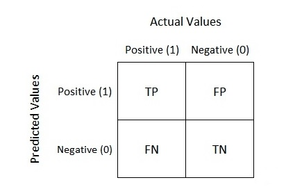
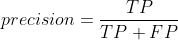
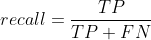
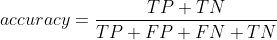
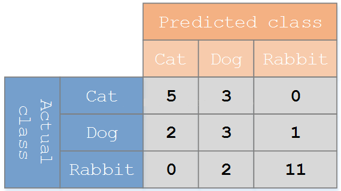

## Content

- [概念说明](#概念说明)
- [性能指标](#性能指标)
  - [检测精度相关](#检测精度相关)
  - [检测速度相关](#检测速度相关)

## 概念说明

目标检测（*Object Detection*），主要做的事情就是：

输入一幅图，输出识别出的图中物体并给出它们的概率和位置。

## 性能指标

### 检测精度相关

- *Precision（准确率），Recall（召回率），Accuracy（正确率）* ：

  

  在解释这三个名词之前，先看一个二分类的混淆矩阵，*Actual Values* 代表实际的分类，*Predicted Values* 代表模型预测的分类，所以：

  - **TP**：指的是预测为真且实际也为真的数量
  - **FP**：指的是预测为真，但实际为假的数量
  - **FN**：指的是预测为假，但实际为真的数量
  - **TN**：指的是预测为假且实际也为假的数量

  那么刚刚三个名词的计算公式为：

  

  

  

  其实这个公式看着不难，但是理解却很抽象，所以这里以一个多分类的实际例子来看下：

  

  在这里面，预测猫的准确率（有时又称为查准率）为 *5 / ( 5+2+0 ) = 71.4%*，预测猫的召回率（有时又称为查全率）为 *5 / ( 5+3+0 ) = 62.5%* ，预测猫的正确率为 *(5 + 3 + 1 + 2 + 11) / (5 + 3 + 1 + 2 + 11 + 3 + 2) = 81.5%* 。

  

- IoU（_**I**ntersection **o**ver **U**nion_，交并比）：

### 检测速度相关