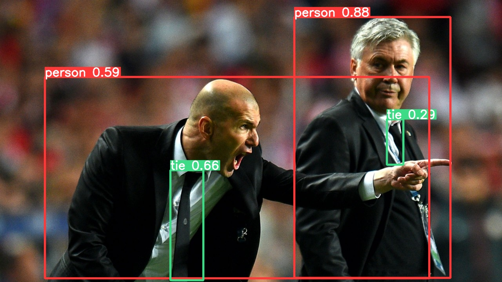

## Content

- [概念说明](#概念说明)
- [性能指标](#性能指标)
  - [检测精度相关](#检测精度相关)
  - [检测速度相关](#检测速度相关)
- [模型知识](#模型知识)
- [图像resize](#图像resize)
  - [网络输出](#网络输出)
  - [landmark](#landmark)
  - [滑动窗口检测](#滑动窗口检测)
  - [边界框预测](#边界框预测)
  - [非极大值抑制](#非极大值抑制)
  - [YOLO](#YOLO)

## 概念说明

目标检测（*Object Detection*），主要做的事情就是：

输入一幅图，输出识别出的图中物体并给出它们的概率和位置。

## 性能指标

### 检测精度相关

- *Precision（准确率），Recall（召回率），Accuracy（正确率）* ：

  

  在解释这三个名词之前，先看一个二分类的混淆矩阵，*Actual Values* 代表实际的分类，*Predicted Values* 代表模型预测的分类，所以：

  - **TP**（_**T**rue **P**ositive_）：指的是预测为真且实际也为真的数量
  - **FP**（_**F**alse **P**ositive_）：指的是预测为真，但实际为假的数量
  - **FN**（_**F**alse **N**egative_）：指的是预测为假，但实际为真的数量
  - **TN**（_**T**rue **N**egative_）：指的是预测为假且实际也为假的数量

  那么刚刚三个名词的计算公式为：

  

  

  

  其实这个公式看着不难，但是理解却很抽象，所以这里以一个多分类的实际例子来看下：

  

  在这里面，预测猫的准确率（有时又称为查准率）为 *5 / ( 5+2+0 ) = 71.4%*，预测猫的召回率（有时又称为查全率）为 *5 / ( 5+3+0 ) = 62.5%* ，预测猫的正确率为 *(5 + 3 + 1 + 2 + 11) / (5 + 3 + 1 + 2 + 11 + 3 + 2) = 81.5%* 。

- IoU（_**I**ntersection **o**ver **U**nion_，交并比）：

  

  指的是预测目标框的精度，是标注的目标框和预测的目标框的交集，除以标注的目标框和预测的目标框的并集。一般会设置一个 IoU 的阈值，比如 *0.5*，当 *IoU ≥ 0.5* 则将其分类为 **TP**，当 *IoU < 0.5*   则将其分类为 **FP**，如果有物体模型未检测出，则将其分类为 **FN**，而 **TN** 则是没有物体也没被标注的情况，由于没有任何实际意义，一般会忽略掉。

- AP（_**A**verage **P**recision_）和mAP（meam AP over classes）：

  - AP 是衡量学习出来的模型在每个类别上的好坏
  - mAP 是衡量学习出来的模型在所有类别上的好坏（就是取所有类别的AP的平均值）

  对于不同的数据集和挑战赛，该计算方式有所不同，比如：

  - 对于PASCAL VOC挑战，如果 IoU > 0.5，则预测为正样本（**TP**），但是如果同一目标的多个检测，则认为第一个为正样本，其余为负样本（**FP**）
  - 对于MS COCO，会间隔 0.05 取 IoU=[0.5, 0.95] 的所有 AP 值再求平均

### 检测速度相关

- 前传耗时（ms）：从输入一张图片到输出最终结果所消耗的时间，包括前处理耗时（如[图像resize](#图像resize)）、网络前传耗时、后处理耗时（如[非极大值抑制](#非极大值抑制)）

- 每秒帧数FPS（**F**rame **P**er **S**econd）：每秒钟能处理的图像数量，和软硬件配置相关
- 浮点运算量FLOPs（**FL**oating point **OP**eration**s**）：处理一张图像所需要的浮点运算数量，跟具体软硬件没有关系，可以用来衡量算法/模型的复杂度，公平地比较不同算法之间的检测速度
- 每秒浮点运算次数FLOPS（**FL**oating point **O**perations **P**er **S**econd）：理解为计算速度，是一个衡量硬件性能的指标

## 模型知识

### 图像resize

相同的图像尺寸被拉伸后，进行训练和测试效果上是没有影响的，但是resize可以使得目标的尺寸变大，使得对小目标检测更加友好，比如：

Original image:

Resized image:

> 这里看起来好像图片更小了，因为网络都是一定大小的图片处理的，如 416x416，那么原始图片都是要变为 416x416 作为输入，但使用这里的直接缩放，不保持宽高比的方式，自然会比保持的更大一些

### 网络输出

一般放的深度学习网络，输出都是一个 *softmax* 层，代表着各个分类的概率，但是由于目标检测中目标定位的存在，输出则可能变为如下的情况（这里用三个类别的单目标识别网络举例）：

其中：

- Pc：是否存在目标，0为不存在，1为存在
- bx，by，bh，bw：标识目标框，(x，y) 为中心点，(w，h) 为宽高
- C1，C2，C3：是三个类别的概率，如目标为车的概率/行人的概率/摩托车的概率

### landmark

目标检测中，有时会存在关键点检测的情况，如人脸检测：

这样的话，对于64个特征点的情况，网络的输出应该为：

通过这种特征点，就可以很容易做到给人脸图片加个皇冠等特效了。

### 滑动窗口检测

### 边界框预测

### 非极大值抑制

### YOLO

