## Content

- [概念说明](#概念说明)

- [性能指标](#性能指标)
  - [检测精度相关](#检测精度相关)
  - [检测速度相关](#检测速度相关)
  
- [模型知识](#模型知识)

  - [数据增强](#数据增强)

  - [图像resize](#图像resize)

  - [网络输出](#网络输出)
  
  - [landmark](#landmark)
  - [滑动窗口检测](#滑动窗口检测)
  - [边界框预测](#边界框预测)
  - [非极大值抑制](#非极大值抑制)
  - [Anchor boxes](#Anchor-boxes)
  - [YOLO](#YOLO)

## 概念说明

目标检测（*Object Detection*），主要做的事情就是：

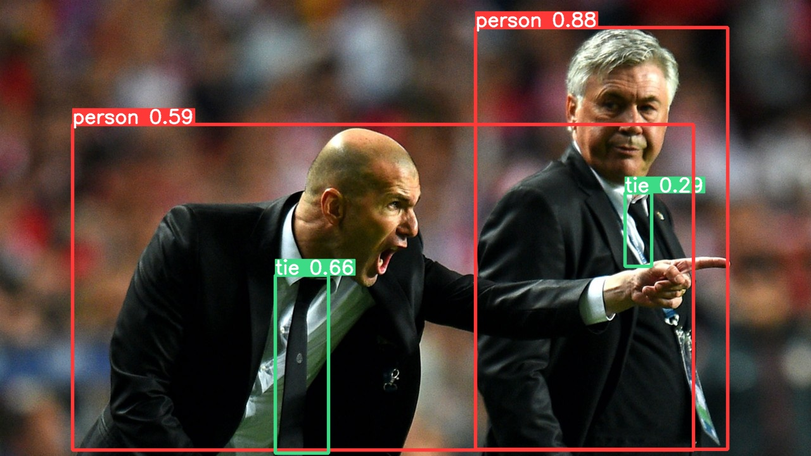

输入一幅图，输出识别出的图中物体并给出它们的概率和位置。

## 性能指标

### 检测精度相关

- *Precision（准确率），Recall（召回率），Accuracy（正确率）* ：

  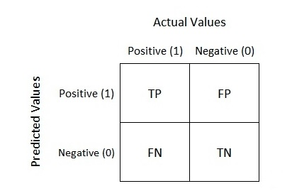

  在解释这三个名词之前，先看一个二分类的混淆矩阵，*Actual Values* 代表实际的分类，*Predicted Values* 代表模型预测的分类，所以：

  - **TP**（_**T**rue **P**ositive_）：指的是预测为真且实际也为真的数量
  - **FP**（_**F**alse **P**ositive_）：指的是预测为真，但实际为假的数量
  - **FN**（_**F**alse **N**egative_）：指的是预测为假，但实际为真的数量
  - **TN**（_**T**rue **N**egative_）：指的是预测为假且实际也为假的数量

  那么刚刚三个名词的计算公式为：

  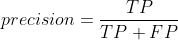

  

  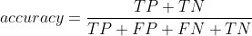

  其实这个公式看着不难，但是理解却很抽象，所以这里以一个多分类的实际例子来看下：

  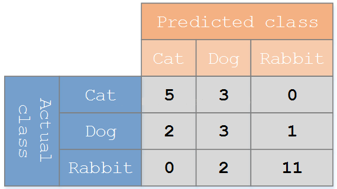

  在这里面，预测猫的准确率（有时又称为查准率）为 *5 / ( 5+2+0 ) = 71.4%*，预测猫的召回率（有时又称为查全率）为 *5 / ( 5+3+0 ) = 62.5%* ，预测猫的正确率为 *(5 + 3 + 1 + 2 + 11) / (5 + 3 + 1 + 2 + 11 + 3 + 2) = 81.5%* 。

- IoU（_**I**ntersection **o**ver **U**nion_，交并比）：

  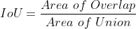

  指的是预测目标框的精度，是标注的目标框和预测的目标框的交集，除以标注的目标框和预测的目标框的并集。一般会设置一个 IoU 的阈值，比如 *0.5*，当 *IoU ≥ 0.5* 则将其分类为 **TP**，当 *IoU < 0.5*   则将其分类为 **FP**，如果有物体模型未检测出，则将其分类为 **FN**，而 **TN** 则是没有物体也没被标注的情况，由于没有任何实际意义，一般会忽略掉。

- AP（_**A**verage **P**recision_）和mAP（meam AP over classes）：

  - AP 是衡量学习出来的模型在每个类别上的好坏
  - mAP 是衡量学习出来的模型在所有类别上的好坏（就是取所有类别的AP的平均值）

  对于不同的数据集和挑战赛，该计算方式有所不同，比如：

  - 对于PASCAL VOC挑战，如果 IoU > 0.5，则预测为正样本（**TP**），但是如果同一目标的多个检测，则认为第一个为正样本，其余为负样本（**FP**）
  - 对于MS COCO，会间隔 0.05 取 IoU=[0.5, 0.95] 的所有 AP 值再求平均

### 检测速度相关

- 前传耗时（ms）：从输入一张图片到输出最终结果所消耗的时间，包括前处理耗时（如[图像resize](#图像resize)）、网络前传耗时、后处理耗时（如[非极大值抑制](#非极大值抑制)）

- 每秒帧数FPS（**F**rame **P**er **S**econd）：每秒钟能处理的图像数量，和软硬件配置相关
- 浮点运算量FLOPs（**FL**oating point **OP**eration**s**）：处理一张图像所需要的浮点运算数量，跟具体软硬件没有关系，可以用来衡量算法/模型的复杂度，公平地比较不同算法之间的检测速度
- 每秒浮点运算次数FLOPS（**FL**oating point **O**perations **P**er **S**econd）：理解为计算速度，是一个衡量硬件性能的指标

## 模型知识

### 数据增强

对于计算机视觉，我们总是不能获得足够的数据，这种时候，数据增强常常能够帮助到你。

在解释数据增强是什么之前，这里介绍数据增强的一些方法，这样就自然明白了它的含义：

- Mirroring：图片做水平/垂直的镜像

- Random Cropping：图片做随机裁剪
- Rotation：图片旋转
- Shearing：剪切图像
- Local warping：图像做不同类型的局部弯曲
- Color shifting：色彩变化，一种较高级的为 PCA Color Augmentation，引入主成分分析，对整体颜色成分更多的颜色做更多的变化，对较少的颜色做更少的变化

到这里就基本明白了，数据增强是在人造一些 ”畸形” 的数据以供模型训练，这样不仅增加了数据，也一定程度上提高了模型的抗干扰能力。

### 图像resize

由于固定训练的网络送入的图像都需要是固定分辨率的，但是真正采集图像时，分辨率会和网络输入存在差异，因此就存在图像 *resize* 的过程。

这里以 *YOLOv5* 为例，在训练时，它采用的方法是 *Mosaic* 数据增强：

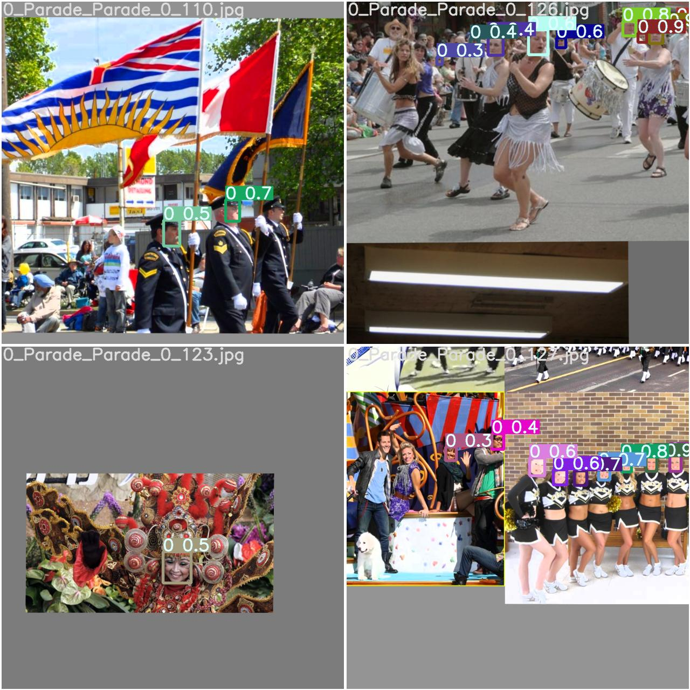

这是一张实际的例子，它将随机选取四张图片，分别进行翻转（对原始图片进行左右的翻转）、缩放（对原始图片进行大小的缩放）、色域变化（对原始图片的明亮度、饱和度、色调进行改变）等操作，再组合成长宽两倍于模型输入的图片大小，作为 *batch* 训练，如 *YOLOv5* 输入为 640 * 640，这里的图片则是 1280 * 1280。

在预测时，则是采用 `letterbox` 的方式，它的主要思想是尽可能的利用网络感受野的信息特征，比如在 *YOLOv5* 中最后一层的 *Stride=5* ，即最后一层的特征图中每个点，可以对应原图中 32 * 32的区域信息，那么只要在保证整体图片变换比例一致的情况下，长宽均可以被32整除，那么就可以有效的利用感受野的信息。

如想要输入 1280 * 720 的图片，首先它会计算 640 / 1280 = 0.5 和 640 / 720 = 0.89，然后选取更小的 0.5 作为缩放比，得到 640 * 360 的图片，下一步则要填充灰白边至360可以被32整除，则应该添加灰白边填充至384，得到 640 * 384 的图片。

这里需要注意的是，并没有完全补到 640 * 640，以免进行不必要的计算。

> 对于卷积的网络，输入更小是能够节省运算的，如对于 *YOLOv5* 而言，640 x 640的图像输入可以得到 1 * 3 ([anchors](Anchor-boxes)) * 85 * ( 80 * 80 + 40 * 40 + 20 * 20) 的输出，但是如果你送入非这么大分辨率的图像依然可以得到截取版的输出：
>
> ```
> D:\ProgramData\Anaconda3\envs\pytorch\python.exe D:/learn_pytorch/yolov5/yolov5/detect.py
> detect: weights=yolov5s.pt, source=data/images, imgsz=[640, 640], conf_thres=0.25, iou_thres=0.45, max_det=1000, device=, view_img=False, save_txt=False, save_conf=False, save_crop=False, nosave=False, classes=None, agnostic_nms=False, augment=False, visualize=False, update=False, project=runs/detect, name=exp, exist_ok=False, line_thickness=3, hide_labels=False, hide_conf=False, half=False
> YOLOv5  v5.0-419-gc5360f6 torch 1.10.2 CUDA:0 (NVIDIA GeForce GTX 1050 Ti, 4095.6875MB)
> 
> Fusing layers... 
> Model Summary: 224 layers, 7266973 parameters, 0 gradients
> image 1/2 D:\learn_pytorch\yolov5\yolov5\data\images\bus.jpg: torch.Size([1, 3, 640, 480])
> torch.Size([1, 18900, 85])
> 640x480 4 persons, 1 bus, 1 fire hydrant, Done. (0.041s)
> image 2/2 D:\learn_pytorch\yolov5\yolov5\data\images\zidane.jpg: torch.Size([1, 3, 384, 640])
> torch.Size([1, 15120, 85])
> 384x640 2 persons, 2 ties, Done. (0.038s)
> Results saved to runs\detect\exp14
> Done. (0.528s)
> 
> Process finished with exit code 0
> ```
> 即输出（1 * 18900 * 85 和 1 * 15120 * 85）会对应裁剪为原来的 0.75（480/640）倍和0.6（384/640）倍。

### 网络输出

一般放的深度学习网络，输出都是一个 *softmax* 层，代表着各个分类的概率，但是由于目标检测中目标定位的存在，输出则可能变为如下的情况（这里用三个类别的单目标识别网络举例）：


其中：

- *Pc* ：是否存在目标，0为不存在，1为存在
- *bx，by，bh，bw* ：标识目标框，(x，y) 为中心点，(w，h) 为宽高
- *C1，C2，C3* ：是三个类别的概率，如目标为车的概率/行人的概率/摩托车的概率

### landmark

目标检测中，有时会存在关键点检测的情况，如人脸检测：

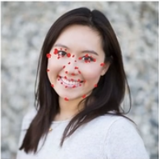

这样的话，对于64个特征点的情况，网络的输出应该为：

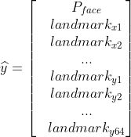

通过这种特征点，就可以很容易做到给人脸图片加个皇冠等特效了。

### 滑动窗口检测

一般而言，对于目标检测，我们训练的数据集往往如下所示


如想要检测汽车，那么基本都会选择紧密的车的数据标注为1，没有车的背景标注为0，进行训练，但实际上，对于目标检测的图片，往往如下所示：

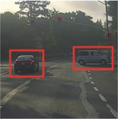

它可能包含大面积的背景，也可能包含多个目标，这样就需要一种方法，能够让我们用紧密车的图片训练的网络可以识别真实场景下拍摄的图片，滑动窗口检测就是一个这种算法，如下所示：

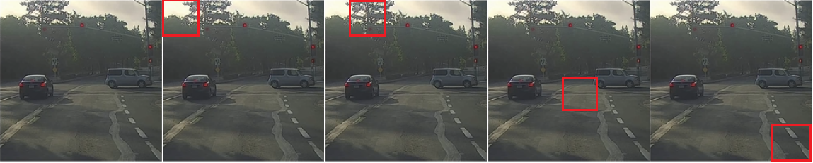

它采用一个固定大小的滑块和固定的步长，在原始图片上进行滑动，每次滑动选择的区域都将送至网络进行检测，从而得到整幅图中哪些滑块区域存在感兴趣的目标的结果集合，但是这还没有结束，下一次将选择更大的滑块，如下是三个不同大小滑块选取的例子：

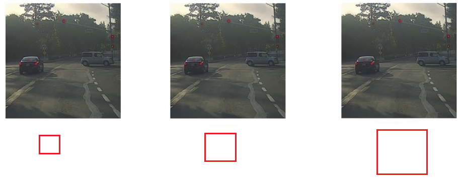

但是它有个极大的缺点，因为它的计算成本非常的高昂，如果你选取一个不密集的步长，那么计算量会减少一些，但是也可能因此丢失目标影响算法表现；如果你选取一个很密集的步长，那么小区域的数量将极度庞大，计算量和计算速度都堪忧。

> 其实这里还有个点要注意，选择不同的滑块是不是就意味着要多个和滑块相匹配的网络呢？实际不是的，通过前面提到的 [图像resize](#图像resize) 就可以了。

幸运地是，有一种方式可以来降低滑动窗口的这种计算量，为了理解降低计算量的方式，先来看一个知识，如何将全连接层使用卷积来实现：

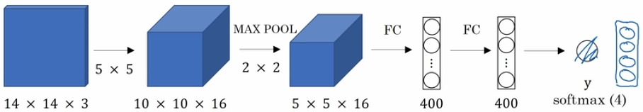

这是一个经典的CNN网络结构，将一幅 14 * 14 * 3 的图像，经过 16 个 5 * 5 * 3 的卷积核，得到 10 * 10 * 16 的结果，再经过 2 * 2 的池化，得到 5 * 5 * 16 的结果，再使用全连接层得到 400 个结果，最后 *softmax* 层到四分类，这个网络的 **FC** （**F**ull **C**onnect）全连接层其实可以用卷积实现如下：

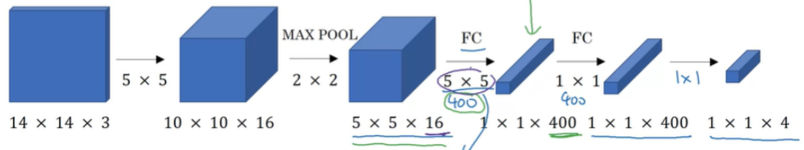

到全连接层的时候，使用 400 个 5 * 5 * 16 的卷积核，就可以得到 1 * 1 * 400 的，同样 400 个结果，最终也可以再使用 4 个 1 * 1 * 400 的卷积得到 1 * 1 * 4 的结果，最终再做一次 *softmax* 就能从数学上与前面的网络保持一致了。

这和滑动窗口检测有什么关系呢？通过一幅图进行说明：

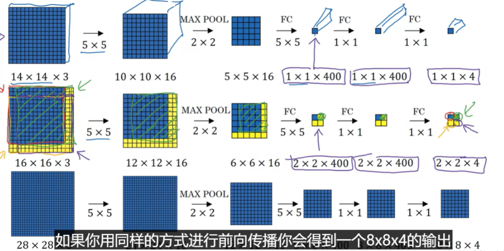


假设此时滑块就是 14 * 14 * 3 的大小，步长为 2，在 16 * 16 * 3 的原始图上进行滑动，那么会得到四个滑动的结果，每个滑动结果的卷积操作，最终可得到 2 * 2 * 4 的预测结果，到这里看似没有计算量的减少，但是实际上这种情况不需要依靠连续的卷积操作来识别图片中的汽车，而是可以对整张图片进行卷积操作，一次得到所有的预测值。

> 和 *YOLOv5* 支持输入小于 640 x 640 的图像一样，对于纯卷积的网络，虽然以前网络只支持 14 * 14 * 3 的输入得到一个结果，但现在输入 28 * 28 * 3 ，依然可以得到 8 * 8 个结果。

### 边界框预测

滑动窗口检测的方法虽然可以检测出一幅图中的多个目标，但是它依然存在一个弊端，即物体的边界框不准，因为物体可能并不是刚好在滑块之内的。

YOLO（**Y**ou **O**nly **L**ook **O**nce）算法是一个比较好的能精确输出边界框的算法：

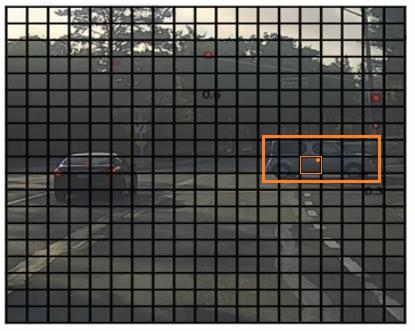

该算法将整个图像 100 * 100 分割为 19 * 19 （举例）的小块，在训练时，它的标注信息是，针对每一个小块，都有前面提到的八维向量：


即 *label* 是一个 19 * 19 * 8 的向量，其中对于有物体的小方格（虽然占有着多个方格），但是只有中心点所在的方格 *Pc* 被标注为 1，如图中的橙色标注区域，只有标注的小框预测 Pc 为 1，且它的 *bx* 和 *by* 则是代表着占着方格的比例，图中的例子大约是 0.9 和 0.1 的样子，而 *bh*  和 *bw* 也是以方格作为单位，（简单点）可以大于1，如这里的例子大约是 2.9 和 5.5 的样子。通过这种标注的训练，最终得到的网络就能实现边界框预测准确了，需要注意的是，它也并不需要将所有的 19 * 19 小方格分别送入网络，而是可以通过一整幅图全部送入的方式，直接出来所有方格的预测结果。

### 非极大值抑制

边界框预测的方式虽然可以准确预测其边界，但是实际图片跑出的结果却可能是包含多个中心点的，如下图所示

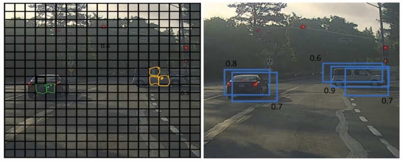

对于真实的同一物体，可能得到的结果会有多个中心点的预测，针对这种情况，非极大值抑制要做的就是清理这些重复的预测，它的做法如下：

1. 去掉所有 *Pc* * *C1/C2/C3* ≤ 0.6 的结果
2. 选择最大的 *Pc* * *C1/C2/C3* 的结果，作为预测值
3. 去掉所有和该结果的 *IoU* ≥ 0.5 的其他结果
4. 重复 2,3，知道所有的结果都遍历过一遍了为止

### Anchor boxes

刚刚提到的是一个 19 * 19 的小方格只有一个分类的情况，对于多个分类就不工作了，而这里提到的 *Anchor boxes* 就是为了解决这一问题：

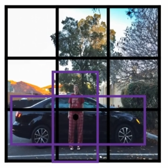

如上图所示，行人的中点和车的中点都是处于第8个小方格的位置，那么第8个小方格依然以


作为输出就没法表示了，因此，*Anchor boxes* 是预先定义好两个不同的形状

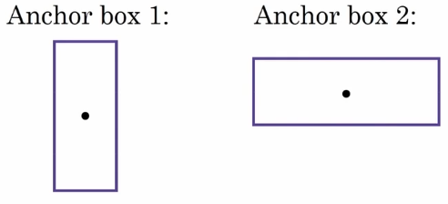

你的网络输出则扩展为

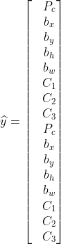

第一部分的8个输出对应 *Anchor box 1*，第二个部分的8个输出对应 *Anchor box 2* ，这样的话，上述的例子，由于行人的目标框和 *Anchor box 1* 更为相似（ *IoU* 值最高），因此在前面8个输出， 汽车的目标框和 *Anchor box 2* 更为相似，因此在后面8个输出。

### YOLO

前面在 [边界框预测](#边界框预测) 提到过 YOLO 的算法，这里将前面的各个知识汇总起来，对 YOLO 算法进行一个更全面的说明：

1. 通过 19 * 19 的小方格划分，在 5 个 *Anchor boxes* 和 3 个分类的情况下，我们的输出将为 19 * 19 * 5 * 8，
2. 首先，我们依旧将去掉所有低可能性的结果
3. 最后，我们会针对每个类别进行非极大值抑制

> YOLO算法中的 *Anchor box* 选取是通过 *K-means* 算法，算法的距离表示是 *1 - IoU*，比较简单地可以理解为：该算法会拿训练的所有带目标的 *boxes* 进行 *K-means* 聚类，得到 K 个 *Anchor boxes*。

