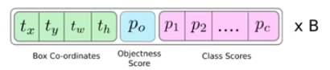
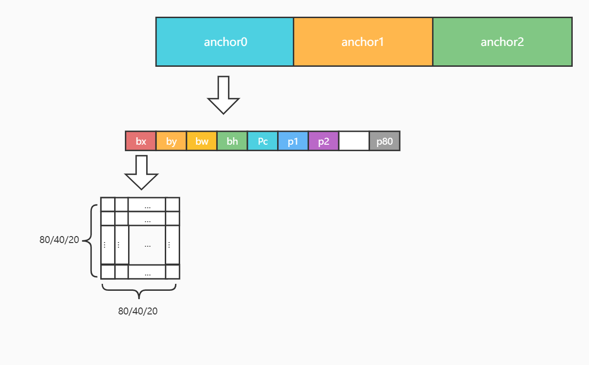

# Let Model Run In Chip

经过一番知识的洗礼，又到了激动人心🚀的在设备上运行模型的时刻了！这一次我们驾轻就熟，用以下几个部分一带而过吧：

- [模型准备](#模型准备)
- [模型转换及模拟器使用](#模型转换及模拟器使用)
- [设备运行](#设备运行)
  - [后处理分析](#后处理分析)
  - [Demo代码运行](#Demo代码运行)

## 模型准备

前面章节已经直接使用过了 *YOLOv5* 的模型看到效果了，但是它并没有使用 `torch.jit.trace` 导出作为瑞芯微可以识别的模型，因此，这里介绍下 *YOLOv5* 的导出方式。

这里的导出和准备工作，厂商都给出了 [README.md](https://github.com/rockchip-linux/rknn-toolkit/tree/master/examples/pytorch/yolov5)  可以说非常简单了，如下内容也是摘选其中：

1. 直接使用 *pytorch* 模型转为 *rknn* 模型时，需要修改 `yolov5/models/yolo.py` 文件的后处理部分，将 `class Detect(nn.Module)` 类的子函数 `forward` 修改为如下代码：

   ```python
   def forward(self, x):
           z = []  # inference output
           for i in range(self.nl):
               x[i] = self.m[i](x[i])  # conv
   
           return x
   ```

   否则会在转模型时报一些算子不支持的错误，这部分其实后面会使用手动处理的方式补齐。

2. 使用 *YOLOv5* 的 `export.py` 脚本进行模型导出，和之前 `torch.jit.trace` 的方式一样，导出的模型会包含整个网络结构信息：

   ```shell
   PS D:\learn_pytorch\yolov5\yolov5> python export.py --weights yolov5s.pt --img 640 --batch 1 --include torchscript
   export: weights=yolov5s.pt, img_size=[640], batch_size=1, device=cpu, include=['torchscript'], half=False, inplace=False, train=False, optimize=False, dynamic=False, simplify=False, opset=13
   YOLOv5  v5.0-419-gc5360f6 torch 1.10.2 CPU
   
   Fusing layers...
   Model Summary: 224 layers, 7266973 parameters, 0 gradients
   
   PyTorch: starting from yolov5s.pt (14.8 MB)
   
   TorchScript: starting export with torch 1.10.2...
   TorchScript: export success, saved as yolov5s.torchscript.pt (29.4 MB)
   
   Export complete (3.56s)
   Results saved to D:\learn_pytorch\yolov5\yolov5
   Visualize with https://netron.app
   ```

最终得到的 `yolov5s.torchscript.pt` 就是可以转为 *rknn* 的 *YOLOv5* 模型了。

**注：**

1. 最好按照厂商建议，使用 commit id 为 c5360f6e7009eb4d05f14d1cc9dae0963e949213 的 *YOLOv5* 分支，否则依然会有转模型出错的情况。

2. 使用 commit id 为 c5360f6e7009eb4d05f14d1cc9dae0963e949213 的 *YOLOv5* 分支，可能 `detect.py` 会运行出类似如下错误：

   ```shell
   PS D:\learn_pytorch\yolov5\yolov5> python detect.py --source .\data\images\bus.jpg
   Downloading https://ultralytics.com/assets/Arial.ttf to C:\Users\Administrator\AppData\Roaming\Ultralytics\Arial.ttf...
   100%|███████████████████████████████████████████████████████████████████████████████████████████████████████████████████████████████████████████████████████████████████████████████████████████████████| 755k/755k [00:01<00:00, 628kB/s]
   detect: weights=yolov5s.pt, source=.\data\images\bus.jpg, imgsz=[640, 640], conf_thres=0.25, iou_thres=0.45, max_det=1000, device=, view_img=False, save_txt=False, save_conf=False, save_crop=False, nosave=False, classes=None, agnostic_
   nms=False, augment=False, visualize=False, update=False, project=runs/detect, name=exp, exist_ok=False, line_thickness=3, hide_labels=False, hide_conf=False, half=False
   requirements: numpy>=1.18.5 not found and is required by YOLOv5, attempting auto-update...
   requirements: 'pip install numpy>=1.18.5' skipped (offline)
   YOLOv5  v5.0-419-gc5360f6 torch 1.10.2 CUDA:0 (NVIDIA GeForce GTX 1050 Ti, 4095.6875MB)
   
   Downloading https://github.com/ultralytics/yolov5/releases/download/v6.1/yolov5s.pt to yolov5s.pt...
   100%|████████████████████████████████████████████████████████████████████████████████████████████████████████████████████████████████████████████████████████████████████████████████████████████████| 14.1M/14.1M [00:06<00:00, 2.26MB/s]
   
   Fusing layers... 
   Model Summary: 213 layers, 7225885 parameters, 0 gradients
   D:\ProgramData\Anaconda3\envs\pytorch\lib\site-packages\torch\functional.py:445: UserWarning: torch.meshgrid: in an upcoming release, it will be required to pass the indexing argument. (Triggered internally at  ..\aten\src\ATen\native\
   TensorShape.cpp:2157.)
     return _VF.meshgrid(tensors, **kwargs)  # type: ignore[attr-defined]
   Traceback (most recent call last):
     File "detect.py", line 289, in <module>
       main(opt)
     File "detect.py", line 284, in main
       run(**vars(opt))
     File "D:\ProgramData\Anaconda3\envs\pytorch\lib\site-packages\torch\autograd\grad_mode.py", line 28, in decorate_context
       return func(*args, **kwargs)
       model(torch.zeros(1, 3, *imgsz).to(device).type_as(next(model.parameters())))  # run once
     File "D:\ProgramData\Anaconda3\envs\pytorch\lib\site-packages\torch\nn\modules\module.py", line 1102, in _call_impl
       return forward_call(*input, **kwargs)
     File "D:\learn_pytorch\yolov5\yolov5\models\yolo.py", line 123, in forward
       return self.forward_once(x, profile, visualize)  # single-scale inference, train
     File "D:\learn_pytorch\yolov5\yolov5\models\yolo.py", line 155, in forward_once
       x = m(x)  # run
     File "D:\ProgramData\Anaconda3\envs\pytorch\lib\site-packages\torch\nn\modules\module.py", line 1102, in _call_impl
       return forward_call(*input, **kwargs)
     File "D:\learn_pytorch\yolov5\yolov5\models\yolo.py", line 64, in forward
       y[..., 2:4] = (y[..., 2:4] * 2) ** 2 * self.anchor_grid[i]  # wh
   RuntimeError: The size of tensor a (80) must match the size of tensor b (56) at non-singleton dimension 3
   ```

   原因在于，commit id 为 c5360f6e7009eb4d05f14d1cc9dae0963e949213 的 *YOLOv5* 分支使用的模型参数 [yolov5s.pt](https://github.com/ultralytics/yolov5/releases/download/v5.0/yolov5s.pt) 是 v5.0 版本的，手动下载这里链接的正确版本放入工程即可：

   ```shell
   PS D:\learn_pytorch\yolov5\yolov5> python detect.py --source .\data\images\bus.jpg
   detect: weights=yolov5s.pt, source=.\data\images\bus.jpg, imgsz=[640, 640], conf_thres=0.25, iou_thres=0.45, max_det=1000, device=, view_img=False, save_txt=False, save_conf=False, save_crop=False, nosave=False, classes=None, agnostic_
   requirements: numpy>=1.18.5 not found and is required by YOLOv5, attempting auto-update...
   requirements: 'pip install numpy>=1.18.5' skipped (offline)
   YOLOv5  v5.0-419-gc5360f6 torch 1.10.2 CUDA:0 (NVIDIA GeForce GTX 1050 Ti, 4095.6875MB)
   
   Fusing layers...
   Model Summary: 224 layers, 7266973 parameters, 0 gradients
   D:\ProgramData\Anaconda3\envs\pytorch\lib\site-packages\torch\functional.py:445: UserWarning: torch.meshgrid: in an upcoming release, it will be required to pass the indexing argument. (Triggered internally at  ..\aten\src\ATen\native\
   TensorShape.cpp:2157.)
     return _VF.meshgrid(tensors, **kwargs)  # type: ignore[attr-defined]
   image 1/1 D:\learn_pytorch\yolov5\yolov5\data\images\bus.jpg: 640x480 4 persons, 1 bus, 1 fire hydrant, Done. (0.028s)
   Results saved to runs\detect\exp5
   Done. (0.091s)
   ```

## 模型转换及模拟器使用

这里提供的 `yolov5` 子文件夹是依据官方的修改部分而来，可以直接运行模拟器看它的效果：

```shell
$ python3 test.py
--> Config model
done
--> Loading model
yolov5s.torchscript.pt ********************
W Pt model version is 1.6(same as you can check through <netron>), but the installed pytorch is 1.10.1+cu102. This may cause the model to fail to load.
done
--> Building model
done
--> Export RKNN model
done
--> Init runtime environment
librknn_runtime version 1.7.1 (bd41dbc build: 2021-10-28 16:15:23 base: 1131)
done
--> Running model
done
--> YOLOv5 post process end
done
class: person, score: 0.99826580286026
box coordinate left,top,right,down: [476.197338283062, 257.57459461688995, 559.819507420063, 517.2954005002975]
class: person, score: 0.9967268705368042
box coordinate left,top,right,down: [111.99989169836044, 233.63885617256165, 218.6885238289833, 528.4154651165009]
class: person, score: 0.978425920009613
box coordinate left,top,right,down: [211.42605847120285, 242.08296704292297, 286.1716588139534, 509.9291789531708]
class: person, score: 0.9698996543884277
box coordinate left,top,right,down: [79.78330028057098, 325.25224447250366, 125.36985218524933, 523.5421891212463]
class: bus , score: 0.9923933744430542
box coordinate left,top,right,down: [82.18040478229523, 135.28777557611465, 561.3988188505173, 444.9854788184166]
```

为了简便，这里同样使用了几个注释的方式来放开 `pre_compile` 的模型转换：

```python
# RKNN_MODEL = 'yolov5s_pre_compile.rknn'
RKNN_MODEL = 'yolov5s.rknn'
...
# QUANTIZE_ON = True
QUANTIZE_ON = False
...
# ret = rknn.build(do_quantization=QUANTIZE_ON, dataset=DATASET, pre_compile=True)
ret = rknn.build(do_quantization=QUANTIZE_ON, dataset=DATASET, pre_compile=False)
...
# exit()
```

使用上面的四个注释部分替换相关代码（除 `exit()` 外），就可以得到能够在设备上运行的 `yolov5s_pre_compile.rknn` 模型了：

```shell
$ python3 test.py
--> Config model
done
--> Loading model
yolov5s.torchscript.pt ********************
W Pt model version is 1.6(same as you can check through <netron>), but the installed pytorch is 1.10.1+cu102. This may cause the model to fail to load.
done
--> Building model
W The RKNN Model generated can not run on simulator when pre_compile is True.
W:tensorflow:From /home/huangkailun/.local/lib/python3.6/site-packages/tensorflow/python/framework/function.py:988: calling Graph.create_op (from tensorflow.python.framework.ops) with compute_shapes is deprecated and will be removed in a future version.
Instructions for updating:
Shapes are always computed; don't use the compute_shapes as it has no effect.
W Rename _dequantize_layer to rknn__dequantize_layer
cc1: warning: command line option ‘-std=c++11’ is valid for C++/ObjC++ but not for C
cc1: warning: command line option ‘-std=c++11’ is valid for C++/ObjC++ but not for C
cc1: warning: command line option ‘-std=c++11’ is valid for C++/ObjC++ but not for C
cc1: warning: command line option ‘-std=c++11’ is valid for C++/ObjC++ but not for C
done
--> Export RKNN model
done
```

## 设备运行

设备上运行的难点其实是它的后处理部分，前面模拟器的代码 `test.py` 中可以看到有个 `yolov5_post_process` 函数，这个就是网络的后处理（检测输出），因此集成时比前面的 *logistic* 还是复杂一些，这里不妨分析一下。

### 后处理分析

在分析核心的 `yolov5_post_process` 函数之前，它调用了 *numpy* 转换的一些代码，如下：

```python
    # post process
    input0_data = outputs[0]
    input1_data = outputs[1]
    input2_data = outputs[2]

    input0_data = input0_data.reshape([3,-1]+list(input0_data.shape[-2:]))
    input1_data = input1_data.reshape([3,-1]+list(input1_data.shape[-2:]))
    input2_data = input2_data.reshape([3,-1]+list(input2_data.shape[-2:]))

    input_data = list()
    input_data.append(np.transpose(input0_data, (2, 3, 0, 1)))
    input_data.append(np.transpose(input1_data, (2, 3, 0, 1)))
    input_data.append(np.transpose(input2_data, (2, 3, 0, 1)))
    
    print('--> YOLOv5 post process end')
    boxes, classes, scores = yolov5_post_process(input_data)
    print('done')
```

通过加一些打印，发现模型的输出是 `outputs[0]`，`outputs[1]` 和 `outputs[2]` ，维度分别是 `(1, 255, 80, 80)`，`(1, 255, 40, 40)` 和 `(1, 255, 20, 20)`，通过 `reshape` 后，它保证其第一维安全变成 3，最后两维保持不变，因此 `input0_data`，`input1_data` 和 `input2_data` 的维度为 `(3, 85, 80, 80)`，`(3, 85, 40, 40)` 和 `(3, 85, 20, 20)`，最后再将维度调换成 `(80, 80, 3, 85)`，`(40, 40, 3, 85)` 和 `(20, 20, 3, 85)` 依次被加入了 `input_data` 这个 `list` 中，传入 `yolov5_post_process` 函数。

这些代表什么？可以通过 *YOLO* 之前的理论知识得到：



它默认的训练完的模型，是包含 80 个类别，这从 `models/yolov5s.yaml` ：

```yaml
# YOLOv5 🚀 by Ultralytics, GPL-3.0 license

# Parameters
nc: 80  # number of classes
depth_multiple: 0.33  # model depth multiple
width_multiple: 0.50  # layer channel multiple
anchors:
  - [10,13, 16,30, 33,23]  # P3/8
  - [30,61, 62,45, 59,119]  # P4/16
  - [116,90, 156,198, 373,326]  # P5/32
...
```

可以看出，加上总的 *score* 和 4 个坐标，就是 85 个，这就是最后一个维度的信息，前面的 `(80, 80)`，`(40, 40)` 和 `(20, 20)` 则代表着将图像分割成了多少个块，而统一的这个 3 则代表了每个 *grid cell* 预测的边界框的数量，即之前提到的，包含 *anchor* 的个数。

之前提到过，*anchor* 是通过 *K-means* 聚类得到的，但是 `test.py` 中直接给出了常数项

```python
def yolov5_post_process(input_data):
    masks = [[0, 1, 2], [3, 4, 5], [6, 7, 8]]
    anchors = [[10, 13], [16, 30], [33, 23], [30, 61], [62, 45],
              [59, 119], [116, 90], [156, 198], [373, 326]]
    ...
```

这也可以通过 `models/yolov5s.yaml` 看到，因为模型参数已经训练好了，自然自带的 *YOLOv5* 模型的 `anchor` 也是训练好的常数项。

再接着分析下一部分：

```python
def yolov5_post_process(input_data):
    masks = [[0, 1, 2], [3, 4, 5], [6, 7, 8]]
    anchors = [[10, 13], [16, 30], [33, 23], [30, 61], [62, 45],
              [59, 119], [116, 90], [156, 198], [373, 326]]

    boxes, classes, scores = [], [], []
    for input,mask in zip(input_data, masks):
        b, c, s = process(input, mask, anchors)
        b, c, s = filter_boxes(b, c, s)
        boxes.append(b)
        classes.append(c)
        scores.append(s)
    ...
```

这个 `for` 循环拆解了 `input_data` 最终得到 `boxes` ，`classes` 和 `scores` ，这个 `process` 函数就是重点了：

```python
def process(input, mask, anchors):

    anchors = [anchors[i] for i in mask]
    grid_h, grid_w = map(int, input.shape[0:2])

    box_confidence = sigmoid(input[..., 4])
    box_confidence = np.expand_dims(box_confidence, axis=-1)

    box_class_probs = sigmoid(input[..., 5:])

    box_xy = sigmoid(input[..., :2])*2 - 0.5

    col = np.tile(np.arange(0, grid_w), grid_h).reshape(-1, grid_w)
    row = np.tile(np.arange(0, grid_h).reshape(-1, 1), grid_w)
    col = col.reshape(grid_h, grid_w, 1, 1).repeat(3, axis=-2)
    row = row.reshape(grid_h, grid_w, 1, 1).repeat(3, axis=-2)
    grid = np.concatenate((col, row), axis=-1)
    box_xy += grid
    box_xy *= (int(IMG_SIZE[1]/grid_h), int(IMG_SIZE[0]/grid_w))

    box_wh = pow(sigmoid(input[..., 2:4])*2, 2)
    box_wh = box_wh * anchors

    box = np.concatenate((box_xy, box_wh), axis=-1)

    return box, box_confidence, box_class_probs
```

这里的过程主要如下：

1. 可以看到，*anchor* 是不同大小的 *grid cell* 使用三个不同的 *anchor*，如 80 * 80 使用的是 *[10, 13], [16, 30], [33, 23]* 这三个
2. `grid_h` 和 `grid_w` ，就是取出的前两维，即在三次循环中分别为 *(80, 80)*，*(40, 40)*  和 *(20, 20)*
3. `box_confidence` 取出的就是前面总的 *score* 值，维度为 *(80, 80, 3)* 然后为了后续方便操作，通过 `np.expand_dims` 将其在最后扩充了一个维度，变为 *(80, 80, 3, 1)*
4. `box_class_probs` 取出的是最后 80 个分类的 *score*，维度为 *(80, 80, 3, 80)*
5. 通过一系列 *grid*，*anchor* 到像素的转换，最终通过 `np.concatenate` 拼接了 *bx, by, bw, bh* 得到的维度为 *(80, 80, 3, 4)*

接下来再来看下完整的 `yolov5_post_process` ：

```python
def yolov5_post_process(input_data):
    masks = [[0, 1, 2], [3, 4, 5], [6, 7, 8]]
    anchors = [[10, 13], [16, 30], [33, 23], [30, 61], [62, 45],
              [59, 119], [116, 90], [156, 198], [373, 326]]

    boxes, classes, scores = [], [], []
    for input,mask in zip(input_data, masks):
        b, c, s = process(input, mask, anchors)
        b, c, s = filter_boxes(b, c, s)
        boxes.append(b)
        classes.append(c)
        scores.append(s)

    boxes = np.concatenate(boxes)
    boxes = xywh2xyxy(boxes)
    classes = np.concatenate(classes)
    scores = np.concatenate(scores)

    nboxes, nclasses, nscores = [], [], []
    for c in set(classes):
        inds = np.where(classes == c)
        b = boxes[inds]
        c = classes[inds]
        s = scores[inds]

        keep = nms_boxes(b, s)

        nboxes.append(b[keep])
        nclasses.append(c[keep])
        nscores.append(s[keep])

    if not nclasses and not nscores:
        return None, None, None

    boxes = np.concatenate(nboxes)
    classes = np.concatenate(nclasses)
    scores = np.concatenate(nscores)

    return boxes, classes, scores
```

在 `process` 后做的事情其实就不多了：

1. 使用 `filter_boxes` ：

   ```python
   def filter_boxes(boxes, box_confidences, box_class_probs):
       box_classes = np.argmax(box_class_probs, axis=-1)
       box_class_scores = np.max(box_class_probs, axis=-1)
       pos = np.where(box_confidences[...,0] >= BOX_THRESH)
   
       boxes = boxes[pos]
       classes = box_classes[pos]
       scores = box_class_scores[pos]
   
       return boxes, classes, scores
   ```

   用 `np.where` 来过滤 *score* 小于 `BOX_THRESH` 的各个值

2. 使用 `np.concatenate` 将 `boxes`，`classes`，`scores` 前面两维融合，得到 *(xxx, 3, 4/80/1)* 的向量

3. 从得分最高的 `class` 开始遍历，使用 `nms_boxes` （*non-max suppression*，非极大值抑制）：

   ```python
   def nms_boxes(boxes, scores):
       x = boxes[:, 0]
       y = boxes[:, 1]
       w = boxes[:, 2] - boxes[:, 0]
       h = boxes[:, 3] - boxes[:, 1]
   
       areas = w * h
       order = scores.argsort()[::-1]
   
       keep = []
       while order.size > 0:
           i = order[0]
           keep.append(i)
   
           xx1 = np.maximum(x[i], x[order[1:]])
           yy1 = np.maximum(y[i], y[order[1:]])
           xx2 = np.minimum(x[i] + w[i], x[order[1:]] + w[order[1:]])
           yy2 = np.minimum(y[i] + h[i], y[order[1:]] + h[order[1:]])
   
           w1 = np.maximum(0.0, xx2 - xx1 + 0.00001)
           h1 = np.maximum(0.0, yy2 - yy1 + 0.00001)
           inter = w1 * h1
   
           ovr = inter / (areas[i] + areas[order[1:]] - inter)
           inds = np.where(ovr <= NMS_THRESH)[0]
           order = order[inds + 1]
       keep = np.array(keep)
       return keep
   ```

   过滤同一物体重复的边界框，求解方法和之前理论一致，按照得分排序，从得分最高的开始遍历，得分最高的直接插入 `keep` 这个 `list` 中，而后续要插入的，则要满足 *IoU* 小于 `NMS_THRESH` 这个条件，继续插入

4. 再使用 `np.concatenate` 合并一个维度，得到最终结果

这样，再来使用 *opencv* 的函数绘制边界框、物体类别及 *score* 就很简单了。

### Demo代码运行

这里可以直接参考 [RK自带的 *YOLOv5* 集成程序](https://github.com/rockchip-linux/rknpu/blob/master/rknn/rknn_api/examples/rknn_yolov5_demo)，源码（自行修改了部分逻辑）已附在当前目录下。

有一点需要注意：

C++ 程序取 `output` 的 *Tensor* 时，维度是 *(1, 255, 80/40/20, 80/40/20)* ，所以内存保存的形式如下：



和 *logistic* 的 *demo* 一样，这里使用了 *OpenCV* 包装了输入和输出，编译方式如下：

```shell
$ /opt/rockchip-linux-toolchain/bin/arm-linux-gnueabihf-g++ -I/home/callon/rksdk/external/rknpu/rknn/rknn_api/librknn_api/include -I/home/callon/opencv-4.5.5/modules/imgcodecs/include -I/home/callon/opencv-4.5.5/modules/core/include -I/home/callon/opencv-4.5.5/modules/imgproc/include -I/home/callon/opencv-4.5.5/build -L/home/callon/rksdk/external/rknpu/rknn/rknn_api/librknn_api/lib -L/home/callon/opencv-4.5.5/build/lib main.cc postprocess.cc -o test -lopencv_imgcodecs -lopencv_imgproc -lopencv_core -lrknn_api -ldl
```

和自带程序相比，该版本支持不同分辨率的图像作为输入且支持非 *bmp* 图像，并且处理部分更加简洁易懂一些：

```shell
[root@RV1126_RV1109:/userdata]# ./test yolov5s_pre_compile.rknn bus.jpg
post process config: box_conf_threshold = 0.50, nms_threshold = 0.60
Loading mode...
librknn_runtime version 1.7.0 (0bef7b3 build: 2021-08-18 19:54:13 base: 1131)
sdk version: librknn_runtime version 1.7.0 (0bef7b3 build: 2021-08-18 19:54:13 base: 1131) driver version: 6.4.6.5.351518
model input num: 1, output num: 3
  index=0, name=x.22_0, n_dims=4, dims=[1, 3, 640, 640], n_elems=1228800, size=1228800, fmt=NCHW, type=UINT8, qnt_type=AFFINE, zp=0, scale=0.003922
  index=0, name=convolution_at_1168_212_out0_215, n_dims=4, dims=[1, 255, 80, 80], n_elems=1632000, size=1632000, fmt=NCHW, type=UINT8, qnt_type=AFFINE, zp=210, scale=0.092896
  index=1, name=convolution_at_1179_213_out0_216, n_dims=4, dims=[1, 255, 40, 40], n_elems=408000, size=408000, fmt=NCHW, type=UINT8, qnt_type=AFFINE, zp=182, scale=0.086178
  index=2, name=convolution_at_1190_214_out0_217, n_dims=4, dims=[1, 255, 20, 20], n_elems=102000, size=102000, fmt=NCHW, type=UINT8, qnt_type=AFFINE, zp=179, scale=0.075776
model is NCHW input fmt
model input height=640, width=640, channel=3
cols: 640, rows: 640
shrink-cols: 640, rows: 640
once run use 110.510000 ms
loadLabelName ./model/coco_80_labels_list.txt
person @ (478 261 559 520) 0.998151
person @ (110 243 220 521) 0.996343
bus @ (87 138 549 440) 0.977877
person @ (209 245 287 507) 0.968013
person @ (78 329 125 520) 0.953956
[root@RV1126_RV1109:/userdata]#
[root@RV1126_RV1109:/userdata]# ./test yolov5s_pre_compile.rknn zidane.jpg
post process config: box_conf_threshold = 0.50, nms_threshold = 0.60
Loading mode...
librknn_runtime version 1.7.0 (0bef7b3 build: 2021-08-18 19:54:13 base: 1131)
sdk version: librknn_runtime version 1.7.0 (0bef7b3 build: 2021-08-18 19:54:13 base: 1131) driver version: 6.4.6.5.351518
model input num: 1, output num: 3
  index=0, name=x.22_0, n_dims=4, dims=[1, 3, 640, 640], n_elems=1228800, size=1228800, fmt=NCHW, type=UINT8, qnt_type=AFFINE, zp=0, scale=0.003922
  index=0, name=convolution_at_1168_212_out0_215, n_dims=4, dims=[1, 255, 80, 80], n_elems=1632000, size=1632000, fmt=NCHW, type=UINT8, qnt_type=AFFINE, zp=210, scale=0.092896
  index=1, name=convolution_at_1179_213_out0_216, n_dims=4, dims=[1, 255, 40, 40], n_elems=408000, size=408000, fmt=NCHW, type=UINT8, qnt_type=AFFINE, zp=182, scale=0.086178
  index=2, name=convolution_at_1190_214_out0_217, n_dims=4, dims=[1, 255, 20, 20], n_elems=102000, size=102000, fmt=NCHW, type=UINT8, qnt_type=AFFINE, zp=179, scale=0.075776
model is NCHW input fmt
model input height=640, width=640, channel=3
cols: 1280, rows: 720
shrink-cols: 640, rows: 640
once run use 109.131000 ms
loadLabelName ./model/coco_80_labels_list.txt
person @ (54 196 1171 713) 0.990266
```

至此，就完成了 *YOLOv5* 模型在设备上的运行。