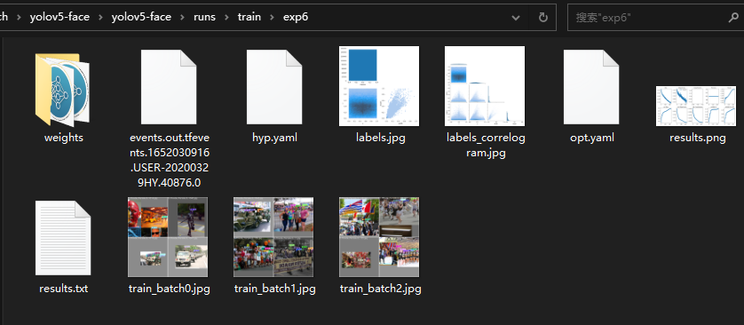

## 模型训练

### 数据准备

1. 下载 [WIDERFACE 图片数据包](http://shuoyang1213.me/WIDERFACE/) 中的 `WIDER_test.zip`，`WIDER_train.zip` 和 `WIDER_val.zip` 

2. 下载 [WIDERFACE 标签包](https://drive.google.com/file/d/1tU_IjyOwGQfGNUvZGwWWM4SwxKp2PUQ8/view?usp=sharing) 

3. 组合成如下目录：

   ```
   yolov5-face/data$ tree -L 2 widerface
   widerface
   ├── test
   │   ├── images
   │   └── label.txt
   ├── train
   │   ├── images
   │   └── label.txt
   └── val
       ├── images
       └── label.txt
   
   6 directories, 3 files
   ```

4. 使用 `train2yolo.py` 和 `val2yolo.py` 重新组织 *yolov5-face* 的训练目录：

   ```
   PS D:\learn_pytorch\yolov5-face\yolov5-face\data> python train2yolo.py .\widerface\train\ ./widerface-yolo/train
   ...
   12878 .\widerface\train\images/9--Press_Conference/9_Press_Conference_Press_Conference_9_131.jpg
   12879 .\widerface\train\images/9--Press_Conference/9_Press_Conference_Press_Conference_9_266.jpg
   PS D:\learn_pytorch\yolov5-face\yolov5-face\data>
   PS D:\learn_pytorch\yolov5-face\yolov5-face\data>
   PS D:\learn_pytorch\yolov5-face\yolov5-face\data>
   PS D:\learn_pytorch\yolov5-face\yolov5-face\data> python .\val2yolo.py ./widerface/ ./widerface-yolo/val/    
   100%|██████████████████████████████████████████████████████████████████████████████████████████████████████████████████████████████████████████████████████████████████████████████████████████████| 42934/42934 [00:48<00:00, 892.04it/s] 
   PS D:\learn_pytorch\yolov5-face\yolov5-face\data>
   ```

5. 在 `data/widerface.yaml` 中指定数据集路径：

   ```
   train: data/widerface-yolo/train  # 16551 images
   val: data/widerface-yolo/val  # 16551 images
   ```

### 训练

这样就具备了运行 `train.py` 的条件，但是运行时可能碰到如下问题：

1. `SPPF` 找不到：

   ```
   AttributeError: Can't get attribute 'SPPF' on <module 'models.common' from 'D:\\learn_pytorch\\yolov5-face\\yolov5-face\\models\\common.py'>
   ```

   这是不同版本的兼容问题，需要到 *Tags6* 里面的 `model/common.py` 里面去找到这个 `SPPF` 的类,把它拷过来到 *Tags5* 的`model/common.py`里面，这样你的代码就也有这个类了，还要引入一个 `warnings` 包，具体修改如下：

   ```python
   import warnings
   ...
   class SPPF(nn.Module):
       # Spatial Pyramid Pooling - Fast (SPPF) layer for YOLOv5 by Glenn Jocher
       def __init__(self, c1, c2, k=5):  # equivalent to SPP(k=(5, 9, 13))
           super().__init__()
           c_ = c1 // 2  # hidden channels
           self.cv1 = Conv(c1, c_, 1, 1)
           self.cv2 = Conv(c_ * 4, c2, 1, 1)
           self.m = nn.MaxPool2d(kernel_size=k, stride=1, padding=k // 2)
   
       def forward(self, x):
           x = self.cv1(x)
           with warnings.catch_warnings():
               warnings.simplefilter('ignore')  # suppress torch 1.9.0 max_pool2d() warning
               y1 = self.m(x)
               y2 = self.m(y1)
               return self.cv2(torch.cat((x, y1, y2, self.m(y2)), 1))
   ```

2. `BrokenPipeError`：

   ```
   BrokenPipeError: [Errno 32] Broken pipe
   ```

   该问题的产生是由于windows下多线程的问题，和 `DataLoader` 类有关，具体细节点这里 [Fix memory leak when using multiple workers on Windows](https://github.com/pytorch/pytorch/pull/5585)。

   需要修改调用 `torch.utils.data.DataLoader()` 函数时的 `num_workers` 参数，位于`utils/face_datasets.py` 中：

   ```python
   def create_dataloader(path, imgsz, batch_size, stride, opt, hyp=None, augment=False, cache=False, pad=0.0, rect=False,
                         rank=-1, world_size=1, workers=8, image_weights=False, quad=False, prefix=''):
       ...
       # nw = min([os.cpu_count() // world_size, batch_size if batch_size > 1 else 0, workers])  # number of workers
       nw = 0
       ...
       dataloader = loader(dataset,
                           batch_size=batch_size,
                           num_workers=nw,
                           sampler=sampler,
                           pin_memory=True,
                           collate_fn=LoadFaceImagesAndLabels.collate_fn4 if quad else LoadFaceImagesAndLabels.collate_fn)
       return dataloader, dataset
   ```

3. `CUDA out of memory` ：

   ```
   RuntimeError: CUDA out of memory. Tried to allocate 20.00 MiB (GPU 0; 4.00 GiB total capacity; 2.88 GiB already allocated; 0 bytes free; 2.90 GiB reserved in total by PyTorch) If reserved memory is >> allocated memory try setting max_split_size_mb to avoid fragmentation.  See documentation for Memory Management and PYTORCH_CUDA_ALLOC_CONF
   
   Process finished with exit code 1
   ```

   这个可能和个人的显卡相关了，这里通过减小 `batch-size` 的方式可以解决：

   ```
   python ./train.py --batch-size 4
   ```

成功后，开始训练打印如下：

```
PS D:\learn_pytorch\yolov5-face\yolov5-face> python ./train.py --batch-size 4
github: skipping check (offline)
YOLOv5 f5dda40 torch 1.10.2 CUDA:0 (NVIDIA GeForce GTX 1050 Ti, 4095.6875MB)

Namespace(adam=False, batch_size=4, bucket='', cache_images=False, cfg='models/yolov5s.yaml', data='data/widerface.yaml', device='', epochs=250, evolve=False, exist_ok=False, global_rank=-1, hyp='data/hyp.scratch.yaml', image_weights=F
alse, img_size=[800, 800], local_rank=-1, log_artifacts=False, log_imgs=16, multi_scale=False, name='exp', noautoanchor=False, nosave=False, notest=False, project='runs/train', rect=False, resume=False, save_dir='runs\\train\\exp6', si
ngle_cls=False, sync_bn=False, total_batch_size=4, weights='weights/yolov5s.pt', workers=4, world_size=1)
Start Tensorboard with "tensorboard --logdir runs/train", view at http://localhost:6006/
Hyperparameters {'lr0': 0.01, 'lrf': 0.2, 'momentum': 0.937, 'weight_decay': 0.0005, 'warmup_epochs': 3.0, 'warmup_momentum': 0.8, 'warmup_bias_lr': 0.1, 'box': 0.05, 'cls': 0.5, 'landmark': 0.005, 'cls_pw': 1.0, 'obj': 1.0, 'obj_pw': 
1.0, 'iou_t': 0.2, 'anchor_t': 4.0, 'fl_gamma': 0.0, 'hsv_h': 0.015, 'hsv_s': 0.7, 'hsv_v': 0.4, 'degrees': 0.0, 'translate': 0.1, 'scale': 0.5, 'shear': 0.5, 'perspective': 0.0, 'flipud': 0.0, 'fliplr': 0.5, 'mosaic': 0.5, 'mixup': 0.
0}

                 from  n    params  module                                  arguments
  0                -1  1      8256  models.common.StemBlock                 [3, 32, 3, 2]
  1                -1  1     16768  models.common.C3                        [32, 64, 1]
  2                -1  1     73984  models.common.Conv                      [64, 128, 3, 2]
  3                -1  1    156928  models.common.C3                        [128, 128, 3]                 
  4                -1  1    295424  models.common.Conv                      [128, 256, 3, 2]
  5                -1  1    625152  models.common.C3                        [256, 256, 3]                 
  6                -1  1   1180672  models.common.Conv                      [256, 512, 3, 2]              
  7                -1  1    656896  models.common.SPP                       [512, 512, [3, 5, 7]]
  8                -1  1   1182720  models.common.C3                        [512, 512, 1, False]          
  9                -1  1    131584  models.common.Conv                      [512, 256, 1, 1]
 10                -1  1         0  torch.nn.modules.upsampling.Upsample    [None, 2, 'nearest']
 11           [-1, 5]  1         0  models.common.Concat                    [1]
 12                -1  1    361984  models.common.C3                        [512, 256, 1, False]          
 13                -1  1     33024  models.common.Conv                      [256, 128, 1, 1]
 14                -1  1         0  torch.nn.modules.upsampling.Upsample    [None, 2, 'nearest']
 15           [-1, 3]  1         0  models.common.Concat                    [1]
 16                -1  1     90880  models.common.C3                        [256, 128, 1, False]
 17                -1  1    147712  models.common.Conv                      [128, 128, 3, 2]
 18          [-1, 13]  1         0  models.common.Concat                    [1]                           
 19                -1  1    296448  models.common.C3                        [256, 256, 1, False]
 20                -1  1    590336  models.common.Conv                      [256, 256, 3, 2]
 21           [-1, 9]  1         0  models.common.Concat                    [1]
 22                -1  1   1182720  models.common.C3                        [512, 512, 1, False]          
 23      [16, 19, 22]  1     43152  models.yolo.Detect                      [1, [[4, 5, 8, 10, 13, 16], [23, 29, 43, 55, 73, 105], [146, 217, 231, 300, 335, 433]], [128, 256, 512]]
D:\ProgramData\Anaconda3\envs\pytorch\lib\site-packages\torch\functional.py:445: UserWarning: torch.meshgrid: in an upcoming release, it will be required to pass the indexing argument. (Triggered internally at  ..\aten\src\ATen\native\
TensorShape.cpp:2157.)
  return _VF.meshgrid(tensors, **kwargs)  # type: ignore[attr-defined]
Model Summary: 292 layers, 7074640 parameters, 7074640 gradients, 15.3 GFLOPS

Transferred 30/374 items from weights/yolov5s.pt
Optimizer groups: 64 .bias, 64 conv.weight, 61 other
Scanning 'data\widerface-yolo\train.cache' for images and labels... 12880 found, 0 missing, 0 empty, 78 corrupted: 100%|████████████████████████████████████████████████████████████████████████████████████| 12880/12880 [00:00<?, ?it/s]
Scanning 'data\widerface-yolo\val.cache' for images and labels... 3226 found, 0 missing, 0 empty, 1 corrupted: 100%|██████████████████████████████████████████████████████████████████████████████████████████| 3226/3226 [00:00<?, ?it/s]
Plotting labels... 

autoanchor: Analyzing anchors... anchors/target = 4.02, Best Possible Recall (BPR) = 0.9997
Image sizes 800 train, 800 test
Using 0 dataloader workers
Logging results to runs\train\exp6
Starting training for 250 epochs...

     Epoch   gpu_mem       box       obj       cls  landmark     total   targets  img_size
     0/249     1.44G    0.0983   0.03835         0    0.1334      0.27       248       800: 100%|███████████████████████████████████████████████████████████████████████████████████████████████████| 3201/3201 [1:15:44<00:00,  1.42s/it] 

     Epoch   gpu_mem       box       obj       cls  landmark     total   targets  img_size
     1/249     1.45G   0.07637   0.03702         0   0.03043    0.1438        18       800: 100%|███████████████████████████████████████████████████████████████████████████████████████████████████| 3201/3201 [1:13:36<00:00,  1.38s/it] 

...
     Epoch   gpu_mem       box       obj       cls  landmark     total   targets  img_size
   249/249     1.41G   0.03612   0.02251         0  0.007549   0.06618        18       800: 100%|█████████████████████████████████████████████████████████████████████████████████████████████████████| 3201/3201 [29:23<00:00,  1.81it/s] 
               Class      Images     Targets           P           R      mAP@.5  mAP@.5:.95: 100%|█████████████████████████████████████████████████████████████████████████████████████████████████████| 807/807 [02:41<00:00,  4.99it/s] 
                 all    3.22e+03    3.96e+04       0.599       0.712       0.707       0.338
Optimizer stripped from runs\train\exp6\weights\last.pt, 14.4MB
Optimizer stripped from runs\train\exp6\weights\best.pt, 14.4MB
250 epochs completed in 160.723 hours.
```

经过漫长的等待，得到位于 `runs\train\exp6` 中的结果：



## 模型测试

使用根目录的 `detect_face.py` 即可：

```
PS D:\learn_pytorch\yolov5-face\yolov5-face> python .\detect_face.py --weights runs/train/exp6/weights/last.pt --image data/images/tly.jpeg
Namespace(image='data/images/tly.jpeg', img_size=640, weights=['runs/train/exp6/weights/last.pt'])
Fusing layers...
D:\ProgramData\Anaconda3\envs\pytorch\lib\site-packages\torch\functional.py:445: UserWarning: torch.meshgrid: in an upcoming release, it will be required to pass the indexing argument. (Triggered internally at  ..\aten\src\ATen\native\
TensorShape.cpp:2157.)
  return _VF.meshgrid(tensors, **kwargs)  # type: ignore[attr-defined]
img.shape:  torch.Size([1, 3, 800, 608])
orgimg.shape:  (700, 511, 3)
```

得到结果（原图和最终的 `result.jpg` ）：


证明训练的权重效果不错。


