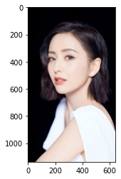
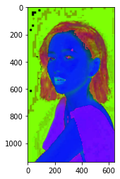
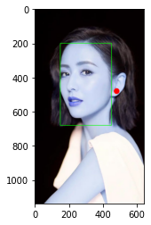
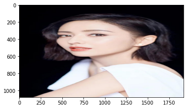
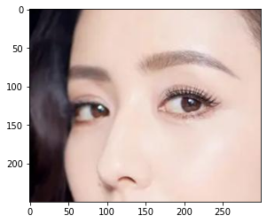

## numpy的基本操作


```python
import numpy as np
a = np.array([1, 2, 3], dtype=np.float32)
a, type(a), a.shape, a.dtype
```


    (array([1., 2., 3.], dtype=float32), numpy.ndarray, (3,), dtype('float32'))


```python
b = np.zeros((3, 3), dtype=np.float32)
print(b, b.shape, b.dtype)
```

    [[0. 0. 0.]
     [0. 0. 0.]
     [0. 0. 0.]] (3, 3) float32
    


```python
c = np.ones((3, 3))
print(c, c.shape, c.dtype)
c = np.ones((3, 3)).astype(np.float32)
print(c, c.shape, c.dtype)
```

    [[1. 1. 1.]
     [1. 1. 1.]
     [1. 1. 1.]] (3, 3) float64
    [[1. 1. 1.]
     [1. 1. 1.]
     [1. 1. 1.]] (3, 3) float32
    


```python
d = np.random.randn(3, 3)
d
```


    array([[-0.51790107,  1.7382346 ,  2.80008284],
           [ 0.31094286,  0.12023191,  0.08898591],
           [ 1.21113966, -1.92903147, -0.67263571]])


```python
f = d[:, 0]
print(f, f.shape)
```

    [-0.51790107  0.31094286  1.21113966] (3,)
    


```python
w = d[:, :2] * 3
w, w.shape
```


    (array([[-1.5537032 ,  5.2147038 ],
            [ 0.93282858,  0.36069572],
            [ 3.63341898, -5.78709442]]),
     (3, 2))


```python
d.argmax(axis=0) # 行方向取最大值，一个列中最大的数所在的行数位置
```


    array([2, 0, 0], dtype=int64)


```python
np.arange(0, 10)
```


    array([0, 1, 2, 3, 4, 5, 6, 7, 8, 9])


```python
f = w.copy()
f[0, :] = 1
print(f)
print(w)
```

    [[ 1.          1.        ]
     [ 0.93282858  0.36069572]
     [ 3.63341898 -5.78709442]]
    [[-1.5537032   5.2147038 ]
     [ 0.93282858  0.36069572]
     [ 3.63341898 -5.78709442]]
    


```python
k = w[[0, 2], :]
k
```


    array([[-1.5537032 ,  5.2147038 ],
           [ 3.63341898, -5.78709442]])


## OpenCV的基本操作


```python
import matplotlib.pyplot as plt
%matplotlib inline
```


```python
import cv2
image = cv2.imread("tly.jpeg") # 3个channel，分别对应BGR
image.shape, image.dtype, type(image)
```


    ((1138, 640, 3), dtype('uint8'), numpy.ndarray)


```python
plt.imshow(image[:, :, [2, 1, 0]]) # plt imshow要求是RGB，但是cv2.imshow是BGR的，可以正常显示
```


    <matplotlib.image.AxesImage at 0x225df521240>


    

    


```python
hsv = cv2.cvtColor(image, cv2.COLOR_BGR2HSV)
plt.imshow(hsv)
```


    <matplotlib.image.AxesImage at 0x225dd0d8f28>


    

    


```python
cv2.rectangle.__doc__
```


    'rectangle(img, pt1, pt2, color[, thickness[, lineType[, shift]]]) -> img\n.   @brief Draws a simple, thick, or filled up-right rectangle.\n.   \n.   The function cv::rectangle draws a rectangle outline or a filled rectangle whose two opposite corners\n.   are pt1 and pt2.\n.   \n.   @param img Image.\n.   @param pt1 Vertex of the rectangle.\n.   @param pt2 Vertex of the rectangle opposite to pt1 .\n.   @param color Rectangle color or brightness (grayscale image).\n.   @param thickness Thickness of lines that make up the rectangle. Negative values, like #FILLED,\n.   mean that the function has to draw a filled rectangle.\n.   @param lineType Type of the line. See #LineTypes\n.   @param shift Number of fractional bits in the point coordinates.\n\n\n\nrectangle(img, rec, color[, thickness[, lineType[, shift]]]) -> img\n.   @overload\n.   \n.   use `rec` parameter as alternative specification of the drawn rectangle: `r.tl() and\n.   r.br()-Point(1,1)` are opposite corners'


```python
cv2.circle.__doc__
```


    'circle(img, center, radius, color[, thickness[, lineType[, shift]]]) -> img\n.   @brief Draws a circle.\n.   \n.   The function cv::circle draws a simple or filled circle with a given center and radius.\n.   @param img Image where the circle is drawn.\n.   @param center Center of the circle.\n.   @param radius Radius of the circle.\n.   @param color Circle color.\n.   @param thickness Thickness of the circle outline, if positive. Negative values, like #FILLED,\n.   mean that a filled circle is to be drawn.\n.   @param lineType Type of the circle boundary. See #LineTypes\n.   @param shift Number of fractional bits in the coordinates of the center and in the radius value.'


```python
x, y, r, b = 150, 200, 450, 680
image = cv2.imread("tly.jpeg")
cv2.rectangle(image, (x, y), (r, b), (0,255,0), 2)
cv2.circle(image, (480, 480), 16, (255,0,0), -1, lineType=16)
plt.imshow(image)
cv2.imwrite("tly_save.png", image)
```


    True


    

    


## PIL库


```python
from PIL import Image
img = Image.open("tly.jpeg")
plt.imshow(img)
type(img)
```


    PIL.JpegImagePlugin.JpegImageFile


    

    


```python
resized = img.resize((1920, 1080))
plt.imshow(resized)
print(resized.size)
```

    (1920, 1080)
    


    

    


```python
cv_img = cv2.imread("tly.jpeg")
pil_img = Image.fromarray(cv_img)
plt.imshow(pil_img)
```


    <matplotlib.image.AxesImage at 0x225dd426898>


    

    


```python
crop = cv_img[250:500, 100:400, :]
plt.imshow(crop[:, :, [2, 1, 0]])
```


    <matplotlib.image.AxesImage at 0x225dd3e6d68>


    

    


## Torch的基本操作


```python
import torch
```


```python
a = torch.tensor([1, 2, 3], dtype=torch.float32)
print(a, a.shape, a.dtype, a.size(0))
```

    tensor([1., 2., 3.]) torch.Size([3]) torch.float32 3
    


```python
b = torch.zeros((3, 3)).float()
print(b, b.size(), b.dtype)
```

    tensor([[0., 0., 0.],
            [0., 0., 0.],
            [0., 0., 0.]]) torch.Size([3, 3]) torch.float32
    


```python
c = torch.tensor([[1,2,3],[4,5,6]]).float()
print(c, c.size(), c.dtype)
```

    tensor([[1., 2., 3.],
            [4., 5., 6.]]) torch.Size([2, 3]) torch.float32
    


```python
d = torch.rand((3, 3)).float()
print(d, d.size(), d.dtype)
```

    tensor([[0.5282, 0.1092, 0.0051],
            [0.7052, 0.2343, 0.2114],
            [0.2719, 0.3715, 0.1924]]) torch.Size([3, 3]) torch.float32
    


```python
e = torch.ones((3, 3))
print(e, e.size(), e.dtype)
```

    tensor([[1., 1., 1.],
            [1., 1., 1.],
            [1., 1., 1.]]) torch.Size([3, 3]) torch.float32
    


```python
f = torch.eye(3, 3)
print(f, f.size(), f.dtype)
```

    tensor([[1., 0., 0.],
            [0., 1., 0.],
            [0., 0., 1.]]) torch.Size([3, 3]) torch.float32
    


```python
# 增加维度： None
k = f[None, :, :, None]
print(k, k.size(), f.shape)

# H W C
# N C H W
# C H W
# 1 C H W
k = f[None]
k.shape
```

    tensor([[[[1.],
              [0.],
              [0.]],
    
             [[0.],
              [1.],
              [0.]],
    
             [[0.],
              [0.],
              [1.]]]]) torch.Size([1, 3, 3, 1]) torch.Size([3, 3])
    


    torch.Size([1, 3, 3])


```python
u = k.squeeze() # 去掉为1的维度
u.shape
```


    torch.Size([3, 3])


```python
l = u.unsqueeze(1)
l.shape
```


    torch.Size([3, 1, 3])


## Torch的自动梯度计算


```python
a = torch.tensor(10.).requires_grad_(True)
b = torch.tensor(5., requires_grad=True)
c = a * b * 1.5
c.backward()
a.grad, b.grad
```


    (tensor(7.5000), tensor(15.))


## Torch的模型


```python
import torch.nn as nn

class Model(nn.Module):
    def __init__(self):
        super(Model, self).__init__()
        self.conv1 = nn.Conv2d(3, 64, 3)
        self.relu1 = nn.ReLU(True)
        
    def forward(self, x):
        self.conv1(x)
        self.relu1(x)
        return x
    
model = Model()
```


```python
dir(model)
```


    ['T_destination',
     '__annotations__',
     '__call__',
     '__class__',
     '__delattr__',
     '__dict__',
     '__dir__',
     '__doc__',
     '__eq__',
     '__format__',
     '__ge__',
     '__getattr__',
     '__getattribute__',
     '__gt__',
     '__hash__',
     '__init__',
     '__init_subclass__',
     '__le__',
     '__lt__',
     '__module__',
     '__ne__',
     '__new__',
     '__reduce__',
     '__reduce_ex__',
     '__repr__',
     '__setattr__',
     '__setstate__',
     '__sizeof__',
     '__str__',
     '__subclasshook__',
     '__weakref__',
     '_apply',
     '_backward_hooks',
     '_buffers',
     '_call_impl',
     '_forward_hooks',
     '_forward_pre_hooks',
     '_get_backward_hooks',
     '_get_name',
     '_is_full_backward_hook',
     '_load_from_state_dict',
     '_load_state_dict_pre_hooks',
     '_maybe_warn_non_full_backward_hook',
     '_modules',
     '_named_members',
     '_non_persistent_buffers_set',
     '_parameters',
     '_register_load_state_dict_pre_hook',
     '_register_state_dict_hook',
     '_replicate_for_data_parallel',
     '_save_to_state_dict',
     '_slow_forward',
     '_state_dict_hooks',
     '_version',
     'add_module',
     'apply',
     'bfloat16',
     'buffers',
     'children',
     'conv1',
     'cpu',
     'cuda',
     'double',
     'dump_patches',
     'eval',
     'extra_repr',
     'float',
     'forward',
     'get_buffer',
     'get_extra_state',
     'get_parameter',
     'get_submodule',
     'half',
     'load_state_dict',
     'modules',
     'named_buffers',
     'named_children',
     'named_modules',
     'named_parameters',
     'parameters',
     'register_backward_hook',
     'register_buffer',
     'register_forward_hook',
     'register_forward_pre_hook',
     'register_full_backward_hook',
     'register_parameter',
     'relu1',
     'requires_grad_',
     'set_extra_state',
     'share_memory',
     'state_dict',
     'to',
     'to_empty',
     'train',
     'training',
     'type',
     'xpu',
     'zero_grad']


```python
model._modules
```


    OrderedDict([('conv1', Conv2d(3, 64, kernel_size=(3, 3), stride=(1, 1))),
                 ('relu1', ReLU(inplace=True))])


```python
for name, operator in model._modules.items():
    print(name, operator)
```

    conv1 Conv2d(3, 64, kernel_size=(3, 3), stride=(1, 1))
    relu1 ReLU(inplace=True)
    


```python
# 模型的加载和保存，无非就是保存网络结构和权重偏置等数据
model.state_dict()
```


    OrderedDict([('conv1.weight',
                  tensor([[[[-0.1802,  0.0698,  0.1413],
                            [-0.0914, -0.0550,  0.0420],
                            [-0.1052,  0.1664,  0.0228]],
                  
                           [[-0.0583, -0.0161,  0.0092],
                            [-0.0979,  0.0545, -0.0906],
                            [-0.0173, -0.1629,  0.0725]],
                  
                           [[-0.0356, -0.0422, -0.1362],
                            [-0.1108,  0.0635,  0.0580],
                            [ 0.0785, -0.1042,  0.1794]]],
                  
                  
                          [[[-0.0261, -0.0586,  0.0803],
                            [-0.1126, -0.1652,  0.1149],
                            [ 0.0454, -0.1324, -0.0651]],
                  
                           [[-0.1484, -0.1476, -0.0007],
                            [-0.0070,  0.0386,  0.0481],
                            [-0.0353,  0.1677, -0.0534]],
                  
                           [[ 0.0477, -0.1034, -0.0368],
                            [ 0.1321,  0.1380, -0.0165],
                            [-0.1282, -0.1924,  0.1431]]],
                  
                  
                          [[[-0.1657, -0.1096,  0.0362],
                            [-0.0743, -0.1702,  0.1775],
                            [-0.1746,  0.0211,  0.0684]],
                  
                           [[-0.0228, -0.1865,  0.0130],
                            [-0.0698, -0.0911, -0.0963],
                            [ 0.1782, -0.0692,  0.1399]],
                  
                           [[ 0.1063,  0.0103, -0.1082],
                            [ 0.1789, -0.0762, -0.1781],
                            [ 0.0680,  0.1752,  0.0811]]],
                  
                  
                          ...,
                  
                  
                          [[[ 0.1383, -0.1693,  0.0707],
                            [-0.1244, -0.1892, -0.0629],
                            [ 0.1653,  0.1885, -0.1760]],
                  
                           [[ 0.1780, -0.1061,  0.0232],
                            [-0.0290, -0.0316,  0.0469],
                            [-0.0453, -0.0734,  0.1347]],
                  
                           [[-0.0537, -0.0331,  0.0936],
                            [-0.1465, -0.1287,  0.0783],
                            [ 0.1151,  0.0601,  0.1728]]],
                  
                  
                          [[[-0.0552,  0.0668,  0.0328],
                            [ 0.0394,  0.0716,  0.1491],
                            [ 0.1088, -0.1658, -0.1868]],
                  
                           [[-0.0566, -0.1720, -0.1705],
                            [ 0.1595,  0.0034,  0.0994],
                            [ 0.0872, -0.1786, -0.1321]],
                  
                           [[-0.0522,  0.0744,  0.1084],
                            [ 0.0439,  0.1525, -0.1659],
                            [-0.0095,  0.1619,  0.0518]]],
                  
                  
                          [[[ 0.1348,  0.0828,  0.1409],
                            [-0.0875, -0.0908, -0.1659],
                            [-0.0425,  0.0117, -0.1730]],
                  
                           [[ 0.0773,  0.0349, -0.0321],
                            [-0.0694,  0.1533,  0.0794],
                            [ 0.0426, -0.0628, -0.0207]],
                  
                           [[-0.1358, -0.0096, -0.0398],
                            [-0.0109,  0.0664,  0.1780],
                            [ 0.0349,  0.1338,  0.1355]]]])),
                 ('conv1.bias',
                  tensor([ 0.1737,  0.0378, -0.1422, -0.1224, -0.1229,  0.1486,  0.1469,  0.1615,
                          -0.0671,  0.0494,  0.1861, -0.1095,  0.1696, -0.0993, -0.1346, -0.0071,
                          -0.1062, -0.1045, -0.1663,  0.1559,  0.1529, -0.0778, -0.1111, -0.0791,
                           0.0449, -0.1572, -0.1583, -0.1324,  0.0952,  0.1333, -0.1867, -0.1166,
                          -0.1702, -0.1923,  0.0479, -0.0398, -0.0318,  0.1633, -0.0974,  0.1111,
                           0.0177, -0.0864, -0.1229,  0.1814,  0.0265, -0.1516,  0.0322, -0.1257,
                          -0.1339,  0.1908,  0.1297, -0.1515, -0.0253,  0.0805,  0.1840,  0.0611,
                          -0.1098, -0.1421, -0.0041,  0.0240, -0.1405,  0.1082,  0.0007,  0.0936]))])


```python
conv1_weight = model.state_dict()["conv1.weight"]
conv1_weight.shape
```


    torch.Size([64, 3, 3, 3])


