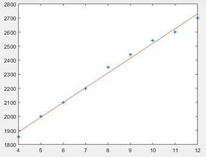
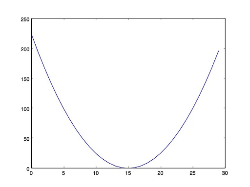
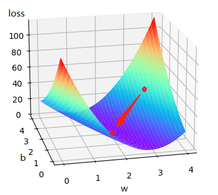
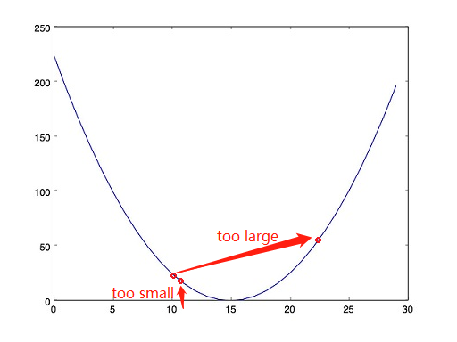
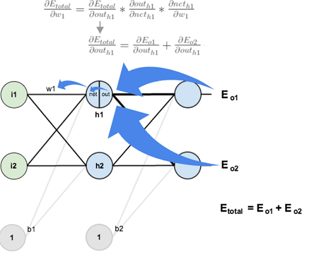

# 通过logistic了解神经网络

## Content

- [通过logistic了解神经网络](#通过logistic了解神经网络)
  - [Content](#content)
  - [背景](#背景)
  - [线性回归](#线性回归)
  - [基本过程](#基本过程)
  - [损失函数](#损失函数)

## 背景

如果去尝试从**原理**上去触及神经网络，很多的讲师（包括本文）都会不可避免地将 *logistic regression* 搬上课堂，因为它真的太基础太重要了，本文也会以该内容作为入口，对神经网络中的各个名词和原理进行解释。

## 线性回归

记得初高中的时候，应该是学过一个叫做线性拟合的知识，如果大家不记得了，这里简单回顾下：

如上图所示，给出了 *9* 个线性相关性较强的离散点，现在想要求出该线性关系，用于预测未来可能的 *x* 对应的 *y* 值，求解该线性关系

的过程即为线性拟合过程。

那么，类比到神经网络中，这个过程又称之为**线性回归**。

### 基本过程

神经网络的过程和刚刚介绍的线性回归是相似的，它由如下四个部分组成：

- `Dataset` : 数据集，对应的就是线性回归中提到的 *9* 个离散的点

- `Model` : 模型，对应的就是线性回归中提到的线性相关性这个性质，不同的是，实际神经网络应用中很多都是非线性的规律，因而要选用各种各样非线性的网络模型

- `Training` ： 训练，对应的就是得到线性回归表达式的过程，不同的是，实际神经网络应用中参数会很多，训练数据也很庞大

- `Inferring` ：预测，对应的就是线性回归最后说的，对于不在训练范围内的数据 *x*，要能尽量准确地预测出它对应的 *y* 值

对于初学者而言，比较难以理解的往往是网络的训练过程，而且其中也涉及几个相关的名词，下面的内容会带着大家逐一进行解释。

### 损失函数

在了解了这些基本的过程后，接下来介绍其第一个数学模型，损失函数。
顾名思义，它代表的是一种损失，那么做预测能有什么损失呢？举个例子大家看看：

| x   | y   |
| --- | --- |
|  2  |  6  |
|  3  |  8  |
|  4  |  10 |

如果此时预测的函数是

那么预测得到的数据就是这样的：

| x   | y_hat |
| --- | ---   |
|  2  |  0    |
|  3  |  1    |
|  4  |  2    |

在线性回归中，所谓损失，就在于预测值与训练数据的差异，差异越大，则损失越大。这样的函数实际可以有很多，如简单求差的绝对值的方式，但线性回归中使用的标准损失函数名为 **MSE**（**M**ean **S**quare **E**rror），公式如下：

^{2})

和求差类似地，它也能得到差异越大则损失越大的结果。

### 梯度下降

梯度这个词一出，感觉都能吓退不少人，但是它真的这么难么？它到底是啥呢？先看一张图：

前一个标题提到的损失函数，其实就是一个二次函数是吧？它画出来也就类似上图这样一个凹函数（神经网络领域一般称之为**凸函数**），所谓梯度就是导数，而梯度下降，指的就是，我们要向损失更小的方向进行移动。如果细抠字眼，你会发现，梯度是导数我能理解，但是梯度下降也就是导数下降，为什么就是向损失最小的方向移动了呢？先上公式：

公式中的 *w* 和 *b* 对应之前预测函数中的参数，该公式就是在神经网络训练过程中对 *w* 和 *b* 的调整依据，梯度下降则值的是 *w* 和 *b* 都会减去梯度进行调整，当梯度降为 *0* 时，*w* 和 *b* 将不再调整，所以说它代表的含义是向损失最小的方向移动：

细心的朋友会发现，梯度“下降”前还有个系数，这个其实也是一个神经网络名词，称之为**学习率**，它决定了梯度下降的步长，如果选择过大，则容易让训练发散（*loss* 无法收敛）而学习失败；如果选择过小，则容易让训练时间过长，如下所示：

### 反向传播

> 看到这里，名词越来越难，但你理解也越来越深了...

所谓反向传播，在线性模型中，它也就是前面提到的梯度下降公式：

这在线性模型中很好理解，因为我们可以轻易地求得梯度表达式：

^{2},\widehat{y}=wx&plus;b\\\\&space;\therefore&space;\frac{\partial&space;loss}{\partial&space;w}=2*x*(wx&plus;b-y),\frac{\partial&space;loss}{\partial&space;b}=2*(wx&plus;b-y))

貌似也感受不到反向的含义，但是如果泛化到复杂一点的网络就不一样了：

这里就可以明显地看出反向传播的过程，从数学上实际上也是链式求导的过程。

## logistic回归

### 损失函数

BCE

### 激活函数

Sigmoid
