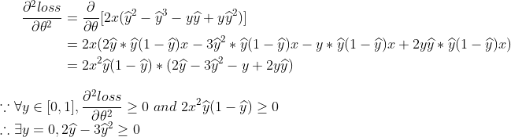
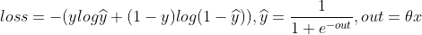

# 通过logistic了解神经网络

## Content

- [通过logistic了解神经网络](#通过logistic了解神经网络)
  - [Content](#content)
  - [背景](#背景)
  - [线性回归](#线性回归)
      - [基本过程](#基本过程)
      - [损失函数](#MSE损失函数)
      - [梯度下降](#梯度下降)
      - [反向传播](#反向传播)
  - [logistic回归](#logistic回归)
      - [激活函数](#激活函数)
      - [损失函数](#BCE损失函数)
      - [随机梯度下降](#随机梯度下降)
      - [Batch](#Batch)
      

## 背景

如果去尝试从**原理**上去触及神经网络，很多的讲师（包括本文）都会不可避免地将 *logistic regression* 搬上课堂，因为它真的太基础太重要了，本文也会以该内容作为入口，对神经网络中的各个名词和原理进行解释。

## 线性回归

记得初高中的时候，应该是学过一个叫做线性拟合的知识，如果大家不记得了，这里简单回顾下：

如上图所示，给出了 *9* 个线性相关性较强的离散点，现在想要求出该线性关系，用于预测未来可能的 *x* 对应的 *y* 值，求解该线性关系

的过程即为线性拟合过程。

那么，类比到神经网络中，这个过程又称之为**线性回归**。

### 基本过程

神经网络的过程和刚刚介绍的线性回归是相似的，它由如下四个部分组成：

- `Dataset` : 数据集，对应的就是线性回归中提到的 *9* 个离散的点

- `Model` : 模型，对应的就是线性回归中提到的线性相关性这个性质，不同的是，实际神经网络应用中很多都是非线性的规律，因而要选用各种各样非线性的网络模型

- `Training` ： 训练，对应的就是得到线性回归表达式的过程，不同的是，实际神经网络应用中参数会很多，训练数据也很庞大

- `Inferring` ：预测，对应的就是线性回归最后说的，对于不在训练范围内的数据 *x*，要能尽量准确地预测出它对应的 *y* 值

对于初学者而言，比较难以理解的往往是网络的训练过程，而且其中也涉及几个相关的名词，下面的内容会带着大家逐一进行解释。

### MSE损失函数

在了解了这些基本的过程后，接下来介绍其第一个数学模型，损失函数。
顾名思义，它代表的是一种损失，那么做预测能有什么损失呢？举个例子大家看看：

| x   | y   |
| --- | --- |
|  2  |  6  |
|  3  |  8  |
|  4  |  10 |

如果此时预测的函数是

那么预测得到的数据就是这样的：

| x   | y_hat |
| --- | ---   |
|  2  |  0    |
|  3  |  1    |
|  4  |  2    |

在线性回归中，所谓损失，就在于预测值与训练数据的差异，差异越大，则损失越大。这样的函数实际可以有很多，如简单求差的绝对值的方式，但线性回归中使用的标准损失函数名为 **MSE**（**M**ean **S**quare **E**rror），公式如下：

和求差类似地，它也能得到差异越大则损失越大的结果。

### 梯度下降

梯度这个词一出，感觉都能吓退不少人，但是它真的这么难么？它到底是啥呢？先看一张图：

前一个标题提到的损失函数，其实就是一个二次函数是吧？它画出来也就类似上图这样一个凹函数（神经网络领域一般称之为**凸函数**），所谓梯度就是导数，而梯度下降，指的就是，我们要向损失更小的方向进行移动。如果细抠字眼，你会发现，梯度是导数我能理解，但是梯度下降也就是导数下降，为什么就是向损失最小的方向移动了呢？先上公式：

公式中的 *w* 和 *b* 对应之前预测函数中的参数，该公式就是在神经网络训练过程中对 *w* 和 *b* 的调整依据，梯度下降则值的是 *w* 和 *b* 都会减去梯度进行调整，当梯度降为 *0* 时，*w* 和 *b* 将不再调整，所以说它代表的含义是向损失最小的方向移动：

细心的朋友会发现，梯度“下降”前还有个系数，这个其实也是一个神经网络名词，称之为**学习率**，它决定了梯度下降的步长，如果选择过大，则容易让训练发散（*loss* 无法收敛）而学习失败；如果选择过小，则容易让训练时间过长，如下所示：

### 反向传播

> 看到这里，名词越来越难，但你理解也越来越深了...

所谓反向传播，在线性模型中，它也就是前面提到的梯度下降公式：

这在线性模型中很好理解，因为我们可以轻易地求得梯度表达式：

貌似也感受不到反向的含义，但是如果泛化到复杂一点的网络就不一样了：

这里就可以明显地看出反向传播的过程，从数学上实际上也是链式求导的过程。

## logistic回归

和之前线性回归不同的是，*logistic* 回归要解决的是分类问题，同时这也是我们接触的第一个非线性网络。

### 激活函数

既然解决的是分类问题，那么就意味着我们的输出不能再是实数了，而应该是某个概率，这是和线性回归最大的不同。

但实际上，*logistic* 回归和线性回归在预测 *y_hat* 的数学公式上只差了一个名为 **激活函数** （*logistic* 回归中取 *sigmoid* 函数作为激活函数）的步骤，函数如下：

可以看到，若令

则可以看到 *sigmoid* 函数初始的样子：

但是，为什么是它呢？我们不妨先将它画出来：

不难发现，它的强大之处在于，它可以将实数范围内的所有数，转换到 *0-1* 的区间范围内来代表某个概率。而且也可以看到，*sigmoid* 函数是一个非线性函数。

### BCE损失函数

和线性回归还有一点不同的是，它的损失函数也不再能使用 **MSE** 了，而应该采用 **BCE**（**B**inary **C**ross **E**ntropy），公式如下：

下面将从三个方面对这个变化进行解释：

1. 比较当 *y=1，y_hat=0* / *y=0，y_hat=1* 的损失值，会发现 *MSE* 得到的损失值为 *1*，而 *BCE* 得到的损失值是无穷大，这也就代表着，*MSE* 对于完全分类出错的情况，也只能施以很小地“惩罚”，但 *BCE* 则会最大程度去“惩罚”，显然 *BCE* 是更合理的。

2. 从原理上，*BCE* 的公式来源于信息论中的 **交叉熵**，主要用于度量两个概率分布间的差异性信息，而 *MSE* 则是用来度量两个实数之间的距离差异信息，显然对于分类问题，交叉熵更合适。

3. 凸函数和非凸函数的本质差异，前面提到的两点，只能看出 *BCE* 更优，但似乎使用 *MSE* 也没有问题，但是这里要说明的是，使用 *MSE* 的损失函数是一个非凸函数，存在局部最优解，将导致训练过程中可能陷入局部最优的点上。

这里展示了凸函数和非凸函数的图像差异，在使用梯度下降法时，对于凸函数，在合适的学习率和迭代次数下，我们最终一定会抵达 *loss* 最小的点，但是对于非凸函数，则很有可能陷入一个局部最优点而无法达到网络对应的最好状态。

这里将给出相关数学证明：

> 首先，要知道一个初高中知识点，即要证明一个函数为凸函数，若该函数二阶可导，那么其实就是证明它的二阶导数大于等于0。
其次，要知道 *wx+b* 可简化为 *θx*，这里的 *θ* 为 *w* 和 *b* 组成的向量，*x* 为原生 *x* 和 *1* 组成的向量，向量的乘法就是原来的 *wx+b*。
还有，这里会省略掉求和标志，这个会在[随机梯度下降](#随机梯度下降)中进行解释。

__对于 *MSE*：__

先求解一阶导数：

再看二阶导数：

可以发现，对于特殊的 *y* 取值为 *0* 的情况，*loss* 函数的二阶导数想要 *≥0*，仅当 *y_hat∈[0,2/3]* 时才能成立，这显然不符，因此说明 *MSE* 作为损失函数是非凸的。

__而对于 *BCE*：__

> 不同的底数的 *log* 函数之间只是差一个系数，因而这里为了简便，*log* 实际就是以 *e* 为底的 *ln* 函数。

先求解一阶导数：

再看二阶导数：

因此说明 *BCE* 作为损失函数是非凸的。

### 随机梯度下降

前面提到了非凸函数，实际上对于工程中，为了解决局部最优解的问题，还有一种方法是 **随机梯度下降**（简称 **SGD** [ **S**tochastic **G**radient **D**escent ] ）。它的原理很简单，就是将之前的数据集随机进行选取，做梯度下降。

请注意，这里其实有两点不同：
1. 求梯度时，再不是之前所有训练样本的梯度之和，而是每一个样本的梯度;
2. 随机选取训练集中的样本

在随机性的样本学习中，如果陷入了局部最优，也有可能因为其他样本的梯度下降而跳出局部最优，最终达到全局最优，这个理论也在实践中被证明有效。

### Batch

前面提到的随机梯度下降虽然很好，但是它却造成了相邻样本之间的依赖关系，即送入 *x(i)* 样本训练的权重 *θ* 是在 *x(i-1)* 样本送入后更新的权重 *θ* 的基础上更新的。

但不采取随机梯度下降是不会有问题的，因为每个样本的训练是独立的，可以并行的。

因此就找了一个折中的方法，将训练集拆分，再每次随机取一小部分数据一起训练，最终以实现一个网络精度和时间复杂度综合最优的训练方式。这样拆取的一小部分数据，则称为一个个的 **Batch**。
