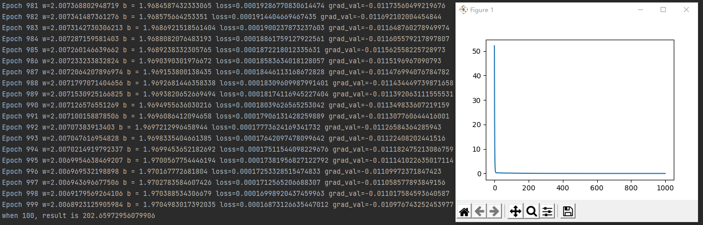

# 通过logistic了解pytorch

## Content

- [通过logistic了解pytorch](#通过logistic了解pytorch)
  - [Content](#content)
  - [背景](#背景)
  - [线性回归](#线性回归)
      - [原理实现](#线性回归原理实现)
      - [学习率过大现象](#学习率过大现象)
      - [学习率过小现象](#学习率过小现象)
      - [随机梯度下降版本](#随机梯度下降版本)
      - [Batch版本](#Batch版本)
      - [Pytorch版本](#线性回归Pytorch版本)
        - [requires_grad](#requires_grad)
        - [torch.nn.Module](#torch.nn.Module)
  - [logistic回归](#logistic回归)
      - [MINIST介绍](#MINIST介绍)
      - [原理实现](#logistic原理实现)
      - [Pytorch版本](#Pytorch版本)
        - [requires_grad](#梯度适配版本)
        - [torch.nn.Module](#模型求解版本)
        - [CrossEntropyLoss](#CrossEntropyLoss)
      - [GPU的使用](#GPU的使用)
      - [模型的保存和加载](#模型的保存和加载)

## 背景

前面大家已经学习了 *python && pytorch* 的基本操作以及 *logistic* 相关的神经网络知识，这里将带着大家使用 *pytorch* 来实现这些知识点。

## 线性回归

这里以如下的数据集

| x   | y   |
| --- | --- |
|  1  |  4  |
|  2  |  6  |
|  3  |  8  |
|  4  |  10 |
|  5  |  12 |
|  6  |  14 |

为例，编写 *python* 程序求解线性回归的表达式。

### 线性回归原理实现

```python
import matplotlib.pyplot as plt

x_data = [1.0, 2.0, 3.0, 4.0, 5.0, 6.0]
y_data = [4.0, 6.0, 8.0, 10.0, 12.0, 14.0]

w = 0.5
b = 0.5
rate = 0.01
loss_set = []

def forward(x):
    return x * w + b

def loss(x, y):
    loss = 0
    for x_val, y_val in zip(x_data, y_data):
        y_pred = forward(x_val)
        loss += (y_pred - y_val) ** 2
    return loss / len(x)

def gradient_w(x, y):
    grad = 0
    for x_val, y_val in zip(x_data, y_data):
        grad += 2 * x_val * (x_val * w + b - y_val)
    return grad / len(x)

def gradient_b(x, y):
    grad = 0
    for x_val, y_val in zip(x_data, y_data):
        grad += 2 * (x_val * w + b - y_val)
    return grad / len(x)

for epoch in range(1000):
    loss_val = loss(x_data, y_data)
    grad_val = gradient_w(x_data, y_data)
    w -= rate * grad_val
    grad_val = gradient_b(x_data, y_data)
    b -= rate * grad_val
    loss_set.append(loss_val)
    print(f"Epoch {epoch} w={w} b = {b} loss={loss_val} grad_val={grad_val}")

result = forward(100)
print(f"when 100, result is {result}")
plt.plot(range(1000), loss_set)
plt.show()
```

上面使用纯数学定义写出的线性回归的代码，运行可得结果如下：



最终基本得到了我们想要的结果，根据数据集推断出了 *w=2.036, b=1.918* 并且预测了 *x=4* 的场景，与实际略有误差但基本吻合。

### 学习率过大现象

还是使用上面的代码，我们这里只修改三处（*range* 相关有两处）：

```python
rate = 0.1
range(100)
```

这次我们调大学习率为 *0.1*，调小循环次数（为了保证不会提前 *overflow*），运行看下：


我们此时看到的现象就是 *loss* 不收敛的情况，最终预测值也是一团糟。

### 学习率过小现象

还是使用上面的代码，我们这里只修改一处：

```python
rate = 0.00001
```

这次我们仅调小学习率为 *0.00001*，循环次数依旧为 *1000* 不变，对比运行结果：


我们此时看到的现象是，由于学习率过小，在 *loss* 还有 *20* 多的情况下就停止了训练，从而导致预测结果相差很大。

### 随机梯度下降版本

```python
import random
import matplotlib.pyplot as plt

def loss(x, y):
    y_pred = forward(x)
    return (y_pred - y) ** 2

def gradient_w(x, y):
    return 2 * x * (x * w + b - y)

def gradient_b(x, y):
    return 2 * (x * w + b - y)

for epoch in range(1000):
    rc = random.randrange(0, 5)
    x = x_data[rc]
    y = y_data[rc]
    loss_val = loss(x, y)
    grad_val = gradient_w(x, y)
    w = w - rate * grad_val
    grad_val = gradient_b(x, y)
    b = b - rate * grad_val
    loss_set.append(loss_val)
    print(f"Epoch {epoch} w={w} b = {b} loss={loss_val} grad_val={grad_val}")
```

在前一版本的基础上，随机梯度下降的修改按照如上代码进行，替换 *loss* 和 *gradient* 的函数定义，以及训练过程采取随机策略即可，运行结果如下:


可以看到由于随机选取数据集的影响，*loss* 在前期是存在震荡的，但是最终依旧可以保持收敛。

### Batch版本

```python
def loss(x, y):
    loss = 0
    for x_val, y_val in zip(x, y):
        y_pred = forward(x_val)
        loss += (y_pred - y_val) ** 2
    return loss / len(x)

def gradient_w(x, y):
    grad = 0
    for x_val, y_val in zip(x, y):
        grad += 2 * x_val * (x_val * w + b - y_val)
    return grad / len(x)

def gradient_b(x, y):
    grad = 0
    for x_val, y_val in zip(x, y):
        grad += 2 * (x_val * w + b - y_val)
    return grad / len(x)

for epoch in range(1000):
    rc = random.randrange(0, 3)
    x = x_data[2*rc:2*rc+2]
    y = y_data[2*rc:2*rc+2]
    loss_val = loss(x, y)
    grad_val = gradient_w(x, y)
    w = w - rate * grad_val
    grad_val = gradient_b(x, y)
    b = b - rate * grad_val
    loss_set.append(loss_val)
    print(f"Epoch {epoch} w={w} b = {b} loss={loss_val} grad_val={grad_val}")
```

在前一版本的基础上，随机梯度下降的修改按照如上代码进行，替换 *loss* 和 *gradient* 的函数定义，以及训练过程采取随机策略即可，运行结果如下:


和随机梯度下降结果基本一致。

### 线性回归Pytorch版本

#### requires_grad

这里我们循序渐进，先基于前面的 [Batch版本](#Batch版本) 和之前的 *torch* 求解自动梯度的知识，修改一版自动求解梯度的版本：

> 这里我们同时也可以去掉不再调用的 `gradient_w` 和 `gradient_b` 函数

```python
import random
import matplotlib.pyplot as plt
import torch

w = torch.Tensor([0.5]).requires_grad_(True)
b = torch.Tensor([0.5]).requires_grad_(True)

for epoch in range(1000):
    rc = random.randrange(0, 3)
    x = x_data[2*rc:2*rc+2]
    y = y_data[2*rc:2*rc+2]
    loss_val = loss(x, y)
    loss_val.backward()
    w.data = w.data - rate * w.grad.data
    b.data = b.data - rate * b.grad.data
    w.grad.data.zero_()
    b.grad.data.zero_()
    loss_set.append(loss_val)
    print(f"Epoch {epoch} w={w} b = {b} loss={loss_val} grad_val={w.grad.data}")
```

需要注意几点特性:

1. 对于需要求解梯度的参数， `loss` 的 `backward()` 方法将自动触发其梯度求解
2. 在梯度更新时，一定要取它的 `data` 字段进行更新，否则由于 `w.grad` 和 `b.grad` 也是 `tensor` 的原因，你的更新操作会被认为是在组织计算图（若数据量很大，会导致计算图组织越来越大而将内存逐步全部吃掉），而不是简单的计算，这里取它的 `data` 就不会产生这种效果，而是仅仅参与计算
3. 对于只有一个值的 `tensor` 可以使用 `item()` 方法转换为标量，如上面的代码打印出来的是 `w=tensor([xxx], xxx)`，如果只需要打印 `w` 的值，可以用 `w={w.item()}` 的方式
4. 下次迭代前，梯度必须使用 `w.grad.data.zero_()` 将梯度清零，否则会造成每次迭代梯度的递增

运行结果如下：


可以看到，这里的结果和[Batch版本](#Batch版本)结果也基本一致。

#### torch.nn.Module

再来修改一个 *pytorch* 中神经网络的版本：

```python
import torch
import matplotlib.pyplot as plt

x_data = torch.Tensor([[1.0], [2.0], [3.0], [4.0], [5.0], [6.0]])
y_data = torch.Tensor([[4.0], [6.0], [8.0], [10.0], [12.0], [14.0]])

loss_set = []

class LinearModel(torch.nn.Module):
    def __init__(self):
        super(LinearModel, self).__init__()
        self.linear = torch.nn.Linear(1, 1)

    def forward(self, x):
        y_pred = self.linear(x)
        return y_pred

model = LinearModel()

criterion = torch.nn.MSELoss()
optimizer = torch.optim.SGD(model.parameters(), lr=0.01)

for epoch in range(1000):
    y_pred = model(x_data)
    loss = criterion(y_pred, y_data)
    optimizer.zero_grad()
    loss.backward()
    optimizer.step()
    loss_set.append(loss.item())
    print(f"epoch{epoch} w={model.linear.weight.item()}, b={model.linear.bias.item()}, loss={loss.item()}")

x_test = torch.Tensor([[100.0]])
result = model(x_test)
print(f"when 100, result is {result}")
plt.plot(range(1000), loss_set)
plt.show()
```

这里的修改点比较多，所以特别列出了所有的代码进行讲解：

1. 新增继承了 `torch.nn.Module` 的 `LinearModel` 类，之前提到过这个模板，但是没有解释为什么需要 `__init__` 和 `forward` 两个函数定义，其实 *python* 中类是有一些隐式的函数的，比如 `__init__` 它类比于 *C++* 中的构造函数，且 `torch.nn.Module` 要求，当继承自 `torch.nn.Module` 时，需要调用父类的构造函数，所以它是必须的；而 `forward` 函数是由于当调用 `model(x_data)` 这种函数时，会调用 *python* 中类的另一个隐式函数 `__call__`，这类比于 *C++* 中的 `operator()` 操作符重载函数，且 `torch.nn.Module` 中的 `__call__` 会自动调用一个名为 `forward` 的函数，因此这两个构成了 *pytorch* 中关于神经网络的主体函数
2. *pytorch* 中自带一些损失函数（如 `torch.nn.MSELoss`）和梯度函数（如 `torch.optim.SGD`），这样可以使用内部的一些方法就能实现和前面相当的功能，这里不再赘述

运行结果如下：


可以看到，这里的结果和前面也基本一致，但是它一次的训练内部会将所有的样本都随机梯度下降一次，因而就看不到像之前单个样本 `random` 取值情况下的 *loss* 前期波动现象了。

## logistic回归

由于 *logistic* 是一个分类网络，因而这里采取的是一个经典的分类问题，手写数字识别的数据集 *MINIST*。

### MINIST介绍

*MINIST* 是一个神经网络经典的初级数据集，该数据集包含 *60,000* 个用于训练的示例和 *10,000* 个用于测试的示例，数据集图片大致长这样：


每张图片都是 *28\*28* 的黑白图像。

*pytorch* 对该数据集有很好地支持，使用如下语句即可将其转换为对应的 *tensor*：

```python
import torchvision
import torch.utils.data as Data

train_set = torchvision.datasets.MNIST(root='./dataset/minist', train=True, transform= torchvision.transforms.ToTensor(), download=True)
test_set = torchvision.datasets.MNIST(root='./dataset/minist', train=False, transform= torchvision.transforms.ToTensor(), download=True)

train_loader = Data.DataLoader(train_set, shuffle=True)
test_loader = Data.DataLoader(train_set, shuffle=True)

for epoch in range(1):
    for batch_idx, data in enumerate(train_loader):
        inputs, target = data
        print(type(inputs), inputs.shape, type(target), target.shape)
```

```
...
<class 'torch.Tensor'> torch.Size([1, 1, 28, 28]) <class 'torch.Tensor'> torch.Size([1])
<class 'torch.Tensor'> torch.Size([1, 1, 28, 28]) <class 'torch.Tensor'> torch.Size([1])
<class 'torch.Tensor'> torch.Size([1, 1, 28, 28]) <class 'torch.Tensor'> torch.Size([1])
<class 'torch.Tensor'> torch.Size([1, 1, 28, 28]) <class 'torch.Tensor'> torch.Size([1])

Process finished with exit code 0
```

不过，注意，它的测试集其实取法不太一样：

```python
for x, y in test_loader:
    print(type(x), type(y))
```

如果想要导出 *MINIST* 数据集为图片，这里给出一个方法（例子只会导出每个数据中的一张，略加改变即可获取所有）：

```python
import os
import torch.optim
import torchvision
from torch.utils.data import DataLoader
from torchvision import transforms
from matplotlib.image import imsave
import torch.nn as nn
from matplotlib import pyplot as plt
input_size = 1*28*28
num_classes = 10
batch_size = 100
lr = 0.01

if not os.path.exists("./minist_image"):
    os.mkdir("./minist_image")

test_set = torchvision.datasets.MNIST(root="./dataset/minist", train=False, transform=transforms.ToTensor(), download=True)

test_loader = DataLoader(dataset=test_set, batch_size=1, shuffle=True, num_workers=0)

for (x, y) in test_loader:
    a = torch.max(y)
    dest_folder = os.path.join("./minist_image", str(a.item()))
    if not os.path.exists(dest_folder):
        os.mkdir(dest_folder)
    else:
        continue
    image_path = os.path.join(dest_folder, '0.png')
    imsave(image_path, x[0, 0, :, :], cmap='gray')
```

### logistic原理实现

```python
import matplotlib.pyplot as plt
import numpy as np
import torchvision
import torch.utils.data as Data

train_set = torchvision.datasets.MNIST(root='./dataset/minist', train=True, transform= torchvision.transforms.ToTensor(), download=True)
test_set = torchvision.datasets.MNIST(root='./dataset/minist', train=False, transform= torchvision.transforms.ToTensor(), download=True)

train_loader = Data.DataLoader(train_set, shuffle=True)
test_loader = Data.DataLoader(train_set, shuffle=True)

input_size = 28 * 28
output_size = 10

w = np.random.randn(input_size, output_size)
b = np.random.randn(1, output_size)

rate = 0.01
loss_set = []


def sigmoid(out):
    y = 1 / (1 + np.exp(-out))
    return y

def forward(x):
    return sigmoid(np.dot(x, w) + b)

def loss(x, y):
    y_pred = forward(x)
    y_array = np.zeros((1, output_size))
    y_array[0][y] = 1.0
    return -np.sum(y_array * np.log(y_pred + 1e-10) + (1 - y_array) * np.log(1 - y_pred + 1e-10))

def gradient_w(x, y):
    y_pred = forward(x)
    y_array = np.zeros((1, output_size))
    y_array[0][y] = 1.0
    ret = np.dot(x.T, y_pred - y_array)
    return ret

def gradient_b(x, y):
    y_pred = forward(x)
    y_array = np.zeros((1, output_size))
    y_array[0][y] = 1.0
    return y_pred - y_array

loop_num = 100

for epoch in range(loop_num):
    num = 0
    for batch_idx, data in enumerate(train_loader):
        inputs, target = data
        inputs = inputs.numpy().reshape(1, -1)
        target = target.item()
        loss_val = loss(inputs, target)
        w -= rate * gradient_w(inputs, target)
        b -= rate * gradient_b(inputs, target)
        num += 1
        if (num % 10000 == 0):
            print(f"Epoch {epoch} loss_val = {loss_val}")
        loss_set.append(loss_val)

correct = 0
total = 0

for inputs, target in test_loader:
    inputs = inputs.numpy().reshape(1, -1)
    y_pred = forward(inputs)
    re = np.where(y_pred == np.max(y_pred))
    total += 1
    if (target == re[1][0]):
        correct += 1

print(100 * correct / total)

plt.plot(range(loop_num * 60000), loss_set)
plt.show()
```

根据前一章的数学原理和上一节的读取 *MINIST* 数据集的方法，这里直接给出了 `numpy` 实现的程序，值得注意的是 `gradient_w` 和 `gradient_b` 的推导前一章在证明时也有涉及，且 `loss` 的求解这里并未取平均（除以 10），因此得到的值会比较大一点。下面展示了该网络的训练结果：


### Pytorch版本

和线性回归的模式一样，这里也将逐步把前一节的程序网络化。

#### 梯度适配版本

```python
import matplotlib.pyplot as plt
import torchvision
import torch.utils.data as Data
import torch

w = torch.randn(input_size, output_size).requires_grad_(True)
b = torch.randn(1, output_size).requires_grad_(True)

def forward(x):
    return torch.sigmoid(torch.matmul(x, w) + b)

def loss(x, y):
    y_pred = forward(x)
    y_array = torch.zeros(1, output_size)
    y_array[0][y] = 1.0
    return -torch.sum(y_array * torch.log(y_pred + 1e-10) + (1 - y_array) * torch.log(1 - y_pred + 1e-10))

loop_num = 10

for epoch in range(loop_num):
    num = 0
    for batch_idx, data in enumerate(train_loader):
        inputs, target = data
        inputs = inputs.view(-1, input_size)
        loss_val = loss(inputs, target)
        loss_val.backward()
        w.data = w.data - rate * w.grad.data
        b.data = b.data - rate * b.grad.data
        w.grad.data.zero_()
        b.grad.data.zero_()
        num += 1
        if (num % 10000 == 0):
            print(f"Epoch {epoch} loss_val = {loss_val}")
        loss_set.append(loss_val)

correct = 0
total = 0

for inputs, target in test_loader:
    inputs = inputs.view(-1, input_size)
    y_pred = forward(inputs)
    _, pred = torch.max(y_pred, 1)
    correct += (pred == target).sum()
    total += 1

print(100 * correct / total)

plt.plot(range(loop_num * 60000), loss_set)
plt.show()
```

这里主要有如下两点修改：

1. 将原来的 `numpy` 主框架换成了 `tensor` 的版本
2. 增加了自动求导的 `requires_grad_` 过程，去除了原来的 `gradient_w` 和 `gradient_b`

为了节省时间，这里只取了 `loop_num` 为 *10* 来看正确率和收敛趋势，实际运行结果如下：


结果和前一版本一致。

#### 模型适配版本

```python
import matplotlib.pyplot as plt
import torchvision
import torch.utils.data as Data
import torch
import torch.nn as nn

class LogisticModel(nn.Module):
    def __init__(self):
        super(LogisticModel, self).__init__()
        self.linear = nn.Linear(input_size, output_size)

    def forward(self, x):
        y_hat = self.linear(x)
        return torch.sigmoid(y_hat)

model = LogisticModel()
criterion = nn.BCELoss()
optimizer = torch.optim.SGD(model.parameters(), lr=rate)

loop_num = 10

for epoch in range(loop_num):
    num = 0
    for batch_idx, data in enumerate(train_loader):
        inputs, target = data
        inputs = inputs.view(-1, input_size)
        y_array = torch.zeros(1, output_size)
        y_array.data[0][target.item()] = 1.0
        y_pred = model(inputs)
        loss_val = criterion(y_pred, y_array)
        optimizer.zero_grad()
        loss_val.backward()
        optimizer.step()
        num += 1
        if (num % 10000 == 0):
            print(f"Epoch {epoch} loss_val = {loss_val.item()}")
        loss_set.append(loss_val.item())

for inputs, target in test_loader:
    inputs = inputs.view(-1, input_size)
    y_pred = forward(inputs)
    _, pred = torch.max(y_pred, 1)
    correct += (pred == target).sum()
    total += 1

print(100 * correct / total)

plt.plot(range(loop_num * 60000), loss_set)
plt.show()
```

这里主要有如下三点修改：

1. 新增了 `LogisticModel` 封装了原来的 `forward` 函数 和  `w` `b` 参数
2. 使用 `torch.nn.BCELoss()` 替换了原来的 `loss` 函数
3. 使用 `torch.optim.SGD` 包装了原来对 `w` 和 `b` 参数的梯度下降过程

最终得到结果如下：


和之前 *loss* 曲线有些不同，估计和 `torch.nn.Linear` 与 原来 `forward` 函数的操作不同相关（包括 `w` `b` 参数初始化等，对比过 `nn.BCELoss()` 和之前 `loss` 函数，将 `loss` 函数的返回值除以 *10* 后得到的结果与 `nn.BCELoss()` 完全一致），但是其准确率是相当的，因此这里也认为替换正常了。

#### 多分类适配版本

前面我们提到，*BCE* 的全称是 **B**inary **C**ross **E**ntropy，也就是说，它是解决二分类问题的一种方法，虽然前面 *MINIST* 编程过程中，我们也能够支持多分类，应用原理就是将多个二分类并成了一个多分类的概率集合，最终通过最大概率来看属于哪个类别。但是这样是有些问题的，因为这样做的情况下，每个分类都是独立的，然而实际问题中，每个分类应当是互相制约的，如当数字 *1* 的概率为 *0.8* 时，其他类别就不应该有这么高的概率了，否则输出会产生矛盾的理解。

因此对于多分类情况，应该还要满足所有类别之和为 *1* 的性质，这样才是一个真正离散分布的结果。

这里采用的一个方式是，引入一个额外的 *Softmax Layer*，它的公式如下：


还是刚刚将多个二分类并成了一个多分类的概率集合的方式，这里 *Softmax* 对于 *y=i* 这个分类的最终结果，将由刚刚二分类的结果作为 *e* 的指数，除以所有分类的 *e* 的概率指数之和。使用 *e* 指数的方式，主要是为了得到大于 *0* 的实数，而除以 *e* 的概率指数之和则是为了满足所有类别之和为 *1* 的性质。

对于多分类的情况，其交叉熵损失函数也会对应做出改变，原来二分类的交叉熵是两个类别 *-ylog(y_hat)* 的和，多分类的交叉熵就自然变成了多个分类的和，在向量上就可以直接写成：


求导也会变得更为复杂一些，感兴趣的朋友可以去推导试试，这里主要看下 *pytorch* 中的应用，这将作为本节最后的一个版本，因此这里给出完整的代码：

```python
import torchvision
import torch.utils.data as Data
import torch
import torch.nn as nn
import matplotlib.pyplot as plt

train_set = torchvision.datasets.MNIST(root='./dataset/minist', train=True, transform= torchvision.transforms.ToTensor(), download=True)
test_set = torchvision.datasets.MNIST(root='./dataset/minist', train=False, transform= torchvision.transforms.ToTensor(), download=True)

train_loader = Data.DataLoader(train_set, batch_size=100, shuffle=True)
test_loader = Data.DataLoader(train_set, batch_size=100, shuffle=True)

input_size = 28 * 28
num_classes = 10
lr = 0.01

class LogisticModel(nn.Module):
    def __init__(self, input_size, num_classes):
        super(LogisticModel, self).__init__()
        self.linear = nn.Linear(input_size, num_classes)

    def forward(self, x):
        y_hat = self.linear(x)
        return y_hat

model = LogisticModel(input_size, num_classes)
criterion = nn.CrossEntropyLoss()
optimizer = torch.optim.SGD(model.parameters(), lr=lr)
loss_set = []

for epoch in range(100):
    for step, (x, y) in enumerate(train_loader):
        x = torch.autograd.Variable(x.view(-1, input_size))
        y = torch.autograd.Variable(y)
        y_pred = model(x)
        loss = criterion(y_pred, y)
        optimizer.zero_grad()
        loss.backward()
        optimizer.step()
        if step % 100 == 0:
            loss_set.append(loss.data)
            print(f"epoch = {epoch} current loss = {loss.data}")

correct = 0
total = 0

for x, y in test_loader:
    x = torch.autograd.Variable(x.view(-1, 28 * 28))
    y_pred = model(x)
    _, pred = torch.max(y_pred.data, 1)
    total += y.size(0)
    correct += (pred == y).sum()

print(100 * correct / total)
plt.plot(loss_set)
plt.show()
```

可以看下这里的改动：

1. 这里给出了一个 *batch* 的训练版本，`batch_size=100`
2. `CrossEntropyLoss` 就是增加了多分类的 *Softmax* 的版本，除此之外，它的输入可以直接是 *MINIST* 的标签，它内部会将标签做 *One-Hot* 编码，再和 *Softmax* 的结果做交叉熵损失求解

看下最终的效果:


可以很明显地看到，收敛更加的平稳自然了，而且采用 *batch* 方式的训练速度也得到了很大地提升。

### GPU的使用

值得关注的是，前面的程序虽然运行正常，但其实都没有用到 *GPU* 资源，对于 *nvidia* 的显卡，使用 *GPU* 都会使用它自带的 *cuda* 驱动，因而 *nvidia* 的显卡环境下，用到 *GPU* 资源其实就是 *cuda* 的资源，*pytorch* 支持的方式也很简单：

```python
a = torch.randn((3, 3)).cuda()
```

在对应需要转换的变量后加上 `.cuda()` 即可。不过，通常情况下，我们更乐意采用另一种方式：

```python
import torchvision
import torch.utils.data as Data
import torch
import torch.nn as nn
import matplotlib.pyplot as plt

train_set = torchvision.datasets.MNIST(root='./dataset/minist', train=True, transform= torchvision.transforms.ToTensor(), download=True)
test_set = torchvision.datasets.MNIST(root='./dataset/minist', train=False, transform= torchvision.transforms.ToTensor(), download=True)

train_loader = Data.DataLoader(train_set, batch_size=100, shuffle=True)
test_loader = Data.DataLoader(train_set, batch_size=100, shuffle=True)

input_size = 28 * 28
num_classes = 10
lr = 0.01
device = torch.device('cuda:0' if torch.cuda.is_available() else 'cpu')

class LogisticModel(nn.Module):
    def __init__(self, input_size, num_classes):
        super(LogisticModel, self).__init__()
        self.linear = nn.Linear(input_size, num_classes).to(device)

    def forward(self, x):
        y_hat = self.linear(x.to(device))
        return y_hat

model = LogisticModel(input_size, num_classes)
criterion = nn.CrossEntropyLoss().to(device)
optimizer = torch.optim.SGD(model.parameters(), lr=lr)
loss_set = []

for epoch in range(100):
    for step, (x, y) in enumerate(train_loader):
        x = torch.autograd.Variable(x.view(-1, input_size))
        y = torch.autograd.Variable(y)
        y_pred = model(x)
        loss = criterion(y_pred, y.to(device))
        optimizer.zero_grad()
        loss.backward()
        optimizer.step()

        if step % 100 == 0:
            loss_set.append(loss.data)
            print(f"epoch = {epoch} current loss = {loss.data}")

correct = 0
total = 0

for x, y in test_loader:
    x = torch.autograd.Variable(x.view(-1, 28 * 28)).to(device)
    y_pred = model(x)
    _, pred = torch.max(y_pred.data, 1)
    total += y.size(0)
    correct += (pred == y.to(device)).sum()

print(100 * correct / total)
plt.plot(loss_set)
plt.show()
```

采用 `torch.cuda.is_available()` 对是否包含 *nvidia* 的 *GPU* 进行判断，而对 `device` 变量赋值，最后通过 `.to(device)` 将对应的操作放到 *nvidia* 的 *GPU* 之上运行。最终结果如下：


准确率和之前结果也相当，但是可以看到此时已经实在 `cuda:0` 上运行的了，训练速度也会比 `cpu` 的略快一些。

### 模型的保存和加载

由于训练的代价高昂，因此 *pytorch* 支持将训练好的网络进行文件导出和导入的功能，程序示例如下：

```python
# after train
torch.save(model, "logistic.pth")
model = torch.load("logistic.pth")
```

这样，在下一次使用时，也可以直接通过 `torch.load` 加载 `torch.save` 保存的模型，而不用再次训练了。

