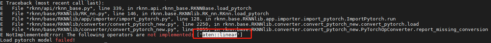
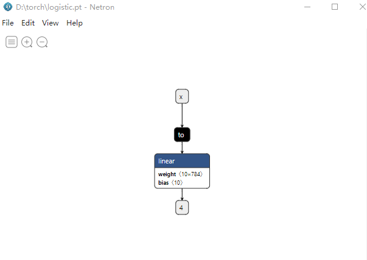
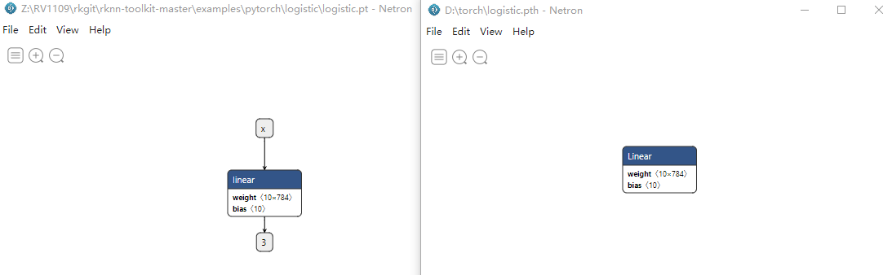

# Let Model Run In Chip

## Content

- [Let Model Run In Chip](#let-model-run-in-chip)
  - [Content](#content)
  - [背景](#背景)
  - [参考文档说明](#参考文档说明)
  - [模型准备](#模型准备)
  - [模型转换及模拟器使用](#模型转换及模拟器使用)
  - [设备运行](#设备运行)


## 背景

作为嵌入式工程师，不将程序跑在芯片上而纸上谈兵的，都是流氓，本文这里将通过手头的一款瑞芯微 *RV1109* 将前文中理论创造的模型真正跑在芯片上。

## 参考文档说明

瑞芯微有一点比较好在于，它的许多资料都已经开源在了其[GitHub](https://github.com/rockchip-linux)上，模型相关的工具介绍，是使用名为[rknn-toolkit](https://github.com/rockchip-linux/rknn-toolkit)的仓库进行查阅，比较重要的文档如下：

- 在 `doc/RKNN_OP_Support_V1.7.1.md` 中有当前版本对哪些训练框架模型的哪些算子进行了支持的说明，这一点很重要，比如笔者手头的SDK中是 *1.6.0* 版本，但是该版本并不支持 *pytorch* 模型中的 `aten::linear` 算子，导致在适配 *logistic* 模型时遇到模型 *Loading* 的报错：



- 在 `doc/Rockchip_Quick_Start_RKNN_Toolkit_V1.7.1_CN.pdf` 中有如何准备环境的示例，这里建议使用*Ubuntu* 的环境，这样可以使用瑞芯微的 *PC* 模拟器，即使没有板子的情况下，也能对模型进行转换和评测，下面列出的是安装环境的核心步骤：

```shell
$ pip3 install rknn_toolkit-1.7.1-cp36-cp36m-linux_x86_64.whl
```

> `.whl` 文件在 `package/README.md` 提到的 [*package* 链接](https://github.com/rockchip-linux/rknn-toolkit/releases) 内解压即可得到。

- 在 `doc/Rockchip_User_Guide_RKNN_Toolkit_V1.7.1_CN.pdf` 中有对使用流程和 *API* 定义的详细说明。

## 模型准备

前面已经训练并且保存了模型，为什么这里还需要准备一次模型呢？原因有两点：

1. 前面为了使用上GPU进行训练和跑模型，采用了 *cuda device* 方式来生成的模型，但是这里需要使用瑞芯微的 *NPU* 来跑模型，如果仍旧用老代码产生的模型转 *RKNN* 模型，将得到 `No CUDA GPUs are available` 的错误，因此需要修改掉这些地方（从模型本身也可以看到，若不进行修改模型输入端会多出一个 `torch.to` 的节点）：



```python
# device = torch.device("cuda:0" if torch.cuda.is_available() else "cpu")

class LogisticModel(nn.Module):
    def __init__(self, input_size, num_classes):
        super(LogisticModel, self).__init__()
        # self.linear = nn.Linear(input_size, num_classes).to(device)
        self.linear = nn.Linear(input_size, num_classes)

    def forward(self, x):
        # y_hat = self.linear(x.to(device))
        y_hat = self.linear(x)
        return y_hat
model = LogisticModel(input_size, num_classes)
# criterion = nn.CrossEntropyLoss().to(device)
criterion = nn.CrossEntropyLoss()
optimizer = torch.optim.SGD(model.parameters(), lr=lr)
loss_set = []

for epoch in range(100):
    for step, (x, y) in enumerate(train_loader):
        x = torch.autograd.Variable(x.view(-1, input_size))
        y = torch.autograd.Variable(y)
        y_pred = model(x)
        # loss = criterion(y_pred, y.to(device))
        loss = criterion(y_pred, y)
        optimizer.zero_grad()
        loss.backward()
        optimizer.step()

        if step % 100 == 0:
            loss_set.append(loss.data)
            print(f"epoch = {epoch} current loss = {loss.data}")
```

2. 在于瑞芯微当前只支持 `torch.jit.trace` 导出的模型，前面用到的保存模型的方式为 `torch.save`，该接口仅仅保存权重参数字典，缺乏网络结构信息，故无法被正常导入并转成 *RKNN* 模型。这部分可从 `doc/Rockchip_Trouble_Shooting_RKNN_Toolkit_V1.7.1_CN.pdf` 中得到相同的回答。而仔细使用 *Netron* 工具比对模型也是可以看到解释中的差异的（修改方式较简单，这里直接给出）：



```python
# torch.save(model, "logistic.pth")
# model = torch.load("logistic.pth")

rand_data = torch.rand(input_size)
store = torch.jit.trace(model, rand_data)
torch.jit.save(store, "logistic.pt")
model = torch.jit.load("logistic.pt")
```

## 模型转换及模拟器使用

模型准备好后，就可以开始激动人心的模型转换环节了，首先切到 `example/pytorch` 中创建 *logistic* 子文件夹：

```shell
$ mkdir logistic
$ ls
logistic  resnet18  yolov5
```

将一张测试图片和 `logistic.pt` 放入，并和其他文件夹一样创建 `dataset.txt` 文件：

```shell
$ cd logistic
$ ls
8.png  dataset.txt  logistic.pt
$ cat dataset.txt
8.png
```

接下来则拷贝一个 `test.py` 的例子（如 `examples/pytorch/resnet18/test.py`）进行修改，修改后的文件已经直接给出，下面提取关键的几处代码：

```python
# pre-process config
print('--> Config model')
rknn.config(target_platform='rv1109')
print('done')

# Build model
print('--> Building model')
# ret = rknn.build(do_quantization=False, dataset='./dataset.txt', pre_compile=True)
ret = rknn.build(do_quantization=False, dataset='./dataset.txt')
if ret != 0:
    print('Build model failed!')
    exit(ret)
print('done')

# Export RKNN model
print('--> Export RKNN model')
# ret = rknn.export_rknn('./logistic_pre_compile.rknn')
ret = rknn.export_rknn('./logistic.rknn')
if ret != 0:
    print('Export logistic.rknn failed!')
    exit(ret)
print('done')

# Export RKNN model
print('--> Export RKNN model')
# ret = rknn.export_rknn('./logistic_pre_compile.rknn')
ret = rknn.export_rknn('./logistic.rknn')
if ret != 0:
    print('Export logistic.rknn failed!')
    exit(ret)
print('done')
# exit(0)

# Set inputs
img = cv2.imread('./8.png')
img = img[:, :, 0]
img.reshape(-1)

# Inference
print('--> Running model')
outputs = rknn.inference(inputs=[img])
print(outputs)
re = np.where(outputs == np.max(outputs))
print(re[2])
print('done')
```

1. *pre-process config* 部分：为了保证在 *RV1109* 设备上运行，需要在 `rknn.config` 接口中指定 `target_platform`

2. *Build model* 部分：当前打开 `do_quantization` 会卡很长很长时间，暂未弄清楚量化前，这里先置为 `False`；当在设备端跑的时候，需要放开对应的注释代码，即配置 `pre_compile=True`，否则最后在设备上跑时会得到 `rknn_init error ret=-14` 的错误信息，但是由于放开预编译将会导致无法在模拟器中运行，所以这里 `exit` 也需要放开

3. *Export RKNN model* 部分：当前面放开 `pre_compile=True` 时，为了保证模型不被覆盖，也最好放开这里的注释，保存为 `logistic_pre_compile.rknn`

4. *Set inputs* 部分：设置输入时，由于这里时灰度 *28\*28* 的图像，但是由于 *png* 读入后会复制为多通道，因而这里需要手动取一个通道，再 *reshape* 成一维送入模型

5. *Inference* 部分：获取输出后，为了更方便地显示结果是数字几，这里使用了 `np.where + np.max` 的方式。

接下来运行脚本：

```shell
$ python3 test.py
W Detect torchvision(0.11.2). If the python program got segment fault error, try to <import tensorflow> before <import torchvision>
--> Config model
done
--> Loading model
./logistic.pt ********************
W Pt model version is 1.6(same as you can check through <netron>), but the installed pytorch is 1.10.1+cu102. This may cause the model to fail to load.
W Channels(784) of input node: x.1 > 128, mean/std values will be set to default 0/1.
W Please do pre-processing manually before inference.
done
--> Building model
done
--> Export RKNN model
done
--> Init runtime environment
librknn_runtime version 1.7.1 (bd41dbc build: 2021-10-28 16:15:23 base: 1131)
done
--> Running model
[array([[ -796.    , -1535.    ,  -618.    ,   118.5625,   603.    ,
          -35.6875,  -602.    ,   210.5   ,   909.    ,  1842.    ]],
      dtype=float32)]
[9]
done
$
```

最后的 *9* 和图片意义相同，模型预测正常，下面准备下预编译的模型版本（放开前面提到的注释）：

```shell
$ python3 test.py
W Detect torchvision(0.11.2). If the python program got segment fault error, try to <import tensorflow> before <import torchvision>
--> Config model
done
--> Loading model
./logistic.pt ********************
W Pt model version is 1.6(same as you can check through <netron>), but the installed pytorch is 1.10.1+cu102. This may cause the model to fail to load.
W Channels(784) of input node: x.1 > 128, mean/std values will be set to default 0/1.
W Please do pre-processing manually before inference.
done
--> Building model
W The RKNN Model generated can not run on simulator when pre_compile is True.
cc1: warning: command line option ‘-std=c++11’ is valid for C++/ObjC++ but not for C
cc1: warning: command line option ‘-std=c++11’ is valid for C++/ObjC++ but not for C
cc1: warning: command line option ‘-std=c++11’ is valid for C++/ObjC++ but not for C
cc1: warning: command line option ‘-std=c++11’ is valid for C++/ObjC++ but not for C
done
--> Export RKNN model
done
$
```

## 设备运行

这里设备运行还有一个要解决的问题，即读取 *png* 图片的问题，因而这里重新交叉编译了下 [*opencv*](https://github.com/opencv/opencv/releases) 并将相关的库拷贝至设备端，交叉编译方式如下：

```shell
$ unzip opencv-4.5.5.zip
$ cd opencv-4.5.5/
$ mkdir build
$ touch toolchain.cmake
$ vim toolchain.cmake
$ cat toolchain.cmake
###########user defined#############
set( CMAKE_SYSTEM_NAME Linux )
set( CMAKE_SYSTEM_PROCESSOR arm )
set( CMAKE_C_COMPILER /opt/rockchip-linux/gcc-arm-8.3-2019.03-x86_64-arm-linux-gnueabihf/bin/arm-linux-gnueabihf-gcc )
set( CMAKE_CXX_COMPILER /opt/rockchip-linux/gcc-arm-8.3-2019.03-x86_64-arm-linux-gnueabihf/bin/arm-linux-gnueabihf-g++ )
###########user defined#############
set( CMAKE_FIND_ROOT_PATH "/usr/local/arm/opencv-depend" )
set( CMAKE_FIND_ROOT_PATH_MODE_PROGRAM NEVER )
set( CMAKE_FIND_ROOT_PATH_MODE_LIBRARY ONLY)
set( CMAKE_FIND_ROOT_PATH_MODE_INCLUDE ONLY)
######################################
$ cmake -DCMAKE_TOOLCHAIN_FILE=toolchain.cmake ../
$ make
```

编译出来的库将存在 `build/lib` 下，由于这里主要使用 `imread` 函数，因此只需要 `libopencv_core.so`，`libopencv_imgproc.so` 和 `libopencv_imgcodecs.so` 三个库即可。

接下来则参考RK给的 `demo` 进行 *C++* 程序编写即可，源码以 `demo_rknn.cpp` 的方式直接给出了，编译如下（依赖 [`librknn_api.so`](https://github.com/rockchip-linux/RKNPUTools) 和前面 *opencv* 相关的三个库）:

```shell
$ /opt/rockchip-linux-toolchain/bin/arm-linux-gnueabihf-g++ -I~/rksdk/external/rknpu/rknn/rknn_api/librknn_api/include -I~/opencv-4.5.5/modules/core/include -I~/opencv-4.5.5/modules/imgcodecs/include -I~/opencv-4.5.5/build -L~/rksdk/external/rknpu/rknn/rknn_api/librknn_api/lib -L~/opencv-4.5.5/build/lib demo_rknn.cpp -o test -lopencv_imgcodecs -lopencv_imgproc -lopencv_core -lrknn_api -ldl
```

编译完成后，将 *test*，*logistic_pre_compile.rknn*，*8.png* 和 *opencv* 相关的三个库拷贝至设备端，直接执行即可：

```shell
[root@RV1126_RV1109:/userdata]# ./test ./logistic_pre_compile.rknn ./8.png
Loading model...
librknn_runtime version 1.7.0 (0bef7b3 build: 2021-08-18 19:54:13 base: 1131)
sdk version: librknn_runtime version 1.7.0 (0bef7b3 build: 2021-08-18 19:54:13 base: 1131) driver version: 6.4.6.5.351518
model input num: 1, output num: 1
index=0 name=x.1_0 n_dims=2 dims=[0 0 1 784] n_elems=784 size=1568 fmt=0 type=1 qnt_type=0 fl=-65 zp=1471 scale=0.000000
index=0 name=linear_at_6_1_out0_2 n_dims=2 dims=[0 0 1 10] n_elems=10 size=20 fmt=0 type=1 qnt_type=0 fl=-65 zp=1471 scale=0.000000
cols: 28, rows: 28
once run use 1.441000 ms
out want_float: 1, index: 0, size: 40
outvalue(4): -796.000000 -1535.000000 -618.000000 118.562500 603.000000 -35.687500 -602.000000 210.500000 909.000000 1842.000000
result number: 9
[root@RV1126_RV1109:/userdata]#
```

之前还提到过，如果使用非预编译的模型，将提示失败，这里也不妨尝试下：

```shell
# ./test ./logistic.rknn ./8.png
Loading model...
librknn_runtime version 1.7.0 (0bef7b3 build: 2021-08-18 19:54:13 base: 1131)
Verify rknn graph fail!
This RKNN model is not a pre-compiled model, but the npu driver is mini driver.
Mini driver only support rknn models with pre-compiled mode.
Create RKNN model fail, error=-14
rknn_init error ret=-14
[root@RV1126_RV1109:/userdata]#
```

到这里，就基本把所有的流程都走了一遍，接下来漫漫的神经网络学习之路还有很长很长（即使只是部署，也涉及量化，自定义算子，精度矫正，模型优化等等，每个都是难题），大家一起加油。
